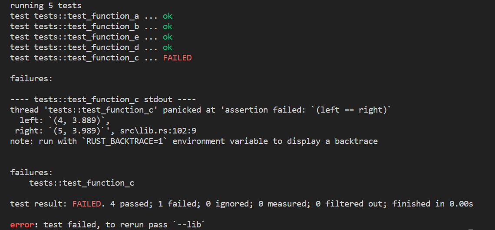
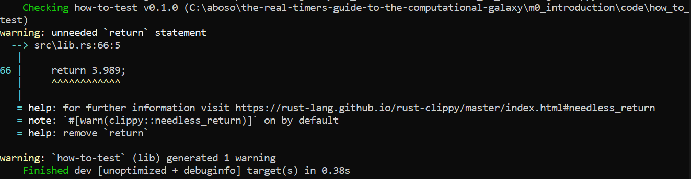

# Introducing Rust
Why use [Rust](https://www.rust-lang.org/) for the guide? Say you've decided you want to eat 35 burgers.
Python is the friend that helps you order them delivered.
C++ is the friend who says 'do whatever you want'. Rust on the other hand,
is the friend who stops you and then recommends you a salad. That may be annoying at times,
especially if you were just craving 35 entire burgers, but it is what is best for you.
Since the guide is not a beginners introduction to programming, and we will be introducing,
at times fairly advanced, concepts, having a language that keeps you on the straight and
narrow, even if it seems pedantic and like it is getting in your way, is a genuine advantage.
If the Rust compiler accepts your code without any unsafe sections, it is probably going to work.
Another point in Rust's favor was the easy setup and use on Windows, Linux and macOS.
The setup time needed to be less than 10 minutes and the chosen language needed an
easy-to-use, preferably integrated, package manager which didn't cause too many versioning issues.  
The options considered were C, C++ and Rust. C and C++ contained too many footguns and required the
use of an external package manager and the use of header files and build systems.
Rust takes care of all that with [cargo](https://doc.rust-lang.org/cargo/index.html).
cargo can help you run and test your code, as well as helping downloading and building all of the
dependencies in the ```Cargo.toml``` file, which you will find in the root of each code project.
The guide was not supposed to be a guide for learning either of those languages.  
Rust's very helpful compiler is likely to be a boon for guiding users towards sensible code.  
The process of having to program in such a memory focused, modern, compiled language
will turn what is otherwise an implicit, unspoken process inside out,
forcing the user to think about what good code is, where is my memory,
which thread has access to which data, and so on.

# Setup
To use the code in the course, as well as doing the exercises, first of all, you should have git and Rust installed.

* [Install git](https://git-scm.com/book/en/v2/Getting-Started-Installing-Git)
* [Install Rust](https://www.rust-lang.org/tools/install)

Once you have installed both, ensure they are properly installed by calling ```git --version``` and
```cargo --version``` in your terminal of choice. Your Rust version should be at least 1.68.
At the least, the code in the guide won't function without support for the 2021 or newer version of Rust.  

* git clone the guides repository
```git clone https://github.com/absorensen/the-real-timers-guide-to-the-computational-galaxy.git```
* In your terminal navigate into the folder that just appeared
* Navigate to ```m0_introduction/code/is_my_system_ready/```
* In the command line write ```cargo run```. This might take a while as cargo will now download and build some
dependencies, and then compile and run the code in debug mode.
* For IDE, the guide has been developed with [VS Code](https://code.visualstudio.com/download) with the
extensions rust-analyzer, CodeLLDB, Rust Syntax, WGSL, wgsl-analyzer and optionally Dracula For Rust Theme.

# Projects
Projects are how a Rust codebase is organized. A project can contain subprojects, but the guide won't use this.
Navigating to your commandline and writing ```cargo new my_project``` will create a project with a ```Cargo.toml```
file and directory named ```src``` in the root. Inside the ```src``` directory there will be a file
named ```main.rs```. The ```Cargo.toml``` is a file describing the name of your project and its dependencies,
which will be empty to begin with. But if you write some dependencies, next time you build the code with
```cargo build``` or ```cargo run```, with or without the ```--release``` flag, cargo will download and build all
of the dependencies. By default cargo will look in the ```src``` directory. All of the files with the
```.rs``` suffix are Rust source files.

Entering ```cargo run``` will compile and run your code in debug mode, which means it will be easier to step
through the code and getting better error messages. It will also result in significantly less compilation
time, but slower run time. If you add ```cargo run --release``` it will compile in release mode.
Compilation will take longer, the code will run faster, but debugging will be harder.

## Frequent commands
To save on space, especially for some of the smaller projects where you just need to run a command or two,
write ```cargo clean``` once you are done to remove all of the relevant dependencies.

# Testing
Cargo can also handle unit testing of code. It requires that the project is split into an application and a
library part, allowing the test to just test the library. In practice what is usually recommended is to just
have a very small function in your application which tells your library to start running your code.

Navigate to the project at ```m0_introduction/code/how_to_test/``` to see how a typical project is
setup. Try running the commands ```cargo run```, followed by ```cargo test```. See how the code ran with
```cargo run```, but ```cargo test``` actually told you which functions weren't living up to expectations?
Setting up these unit tests is also how the guide tells you that the code you have been asked to write is correct.
When doing exercises, keep going until all of the tests pass!

<figure markdown>
{ width="500" }
<figcaption>
Fix the values in test_function_c() and run cargo test again!
</figcaption>
</figure>

Now be sure to take a minute to look at the files involved in a project and read all of the comments!
Sometimes you need more info as to what went wrong with the test. There's a
[fix for that on Windows](https://stackoverflow.com/questions/59131262/rust-backtrace-on-windows).

On some computers the GPU tests will currently fail unless being run with ```cargo test -- --test-threads=1```
as the tests are running concurrently. All of the tests requiring GPU access will try to grab the GPU without
sharing resources. Even then it might fail. You can just try a few more times or try to run tests individually.  

# \*Clippy
[Clippy](https://doc.rust-lang.org/stable/clippy/index.html) is cargo's tool for giving suggestions for improving
your code and making it more akin to idiomatic Rust. The guide has most code conformant to Clippy's suggestions,
however the guide chooses to diverge where making the code simpler and easier to understand for people who have
never programmed Rust before is a priority. Clippy's messages are very informative and a good learning experience.
It is recommended that you use Clippy in your own code. It is as simple as calling ```cargo clippy```.

Running it on the ```how_to_test``` project, Clippy returns the following message -
<figure markdown>
{ width="500" }
<figcaption>
The guide elects not to fix this, because the return statement was put there to make a point.
</figcaption>
</figure>

# \*rustfmt
[rustfmt](https://github.com/rust-lang/rustfmt) is a formatter for Rust. Surprise!
You can install it by running ```rustup component add rustfmt``` in a terminal. From then on you can run commands
like ```cargo fmt```, which automatically changes the code in your current crate (subproject, or the entire project if you are standing in the root). 

# \*fix
[fix](https://doc.rust-lang.org/book/appendix-04-useful-development-tools.html#fix-your-code-with-rustfix) is
a tool for taking as many of those pesky compiler warnings as possible, and fixing your code for you. You just
enter ```cargo fix```.