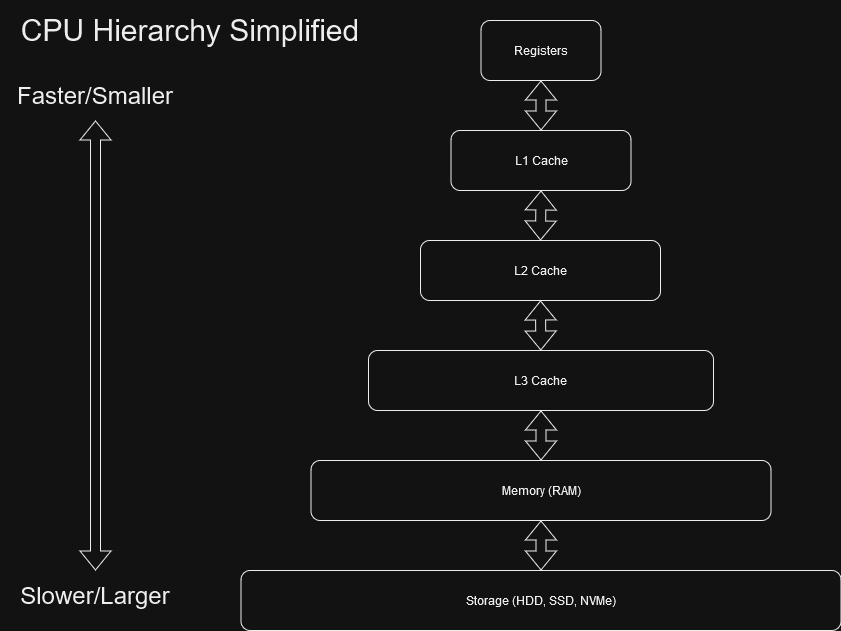

# Memory Hierarchies and the CPU
As mentioned in the module intro,

## Introduction to memory hierarchies
Go back to just CPU, registers, caches and memory.
Computer diagram
Register
Cache
RAM

<figure markdown>
{ width="500" }
<figcaption>
<a href="https://www.cs.umd.edu/~meesh/411/CA-online/chapter/memory-hierarchy-design-basics/index.html">
Image credit REPLACE ME </a>
</figcaption>
</figure>

<figure markdown>
{ width="500" }
<figcaption>
<a href="https://en.wikipedia.org/wiki/File:Hwloc.png">
Image credit </a>
</figcaption>
</figure>

## Pointers, Heap and Stack, Dynamic Arrays
### Pointers and Allocations
What is a pointer  
What is an allocation  
What is freeing  

### Heap and Stack
Remember the more detailed description in the level 3 section Virtualized Memory Hierarchy.
Confusingly, there is also a data structure called heap. This heap is not the same.

### The Vector
Column-major, row-major. We can index however we want if we keep track of it ourselves and use 1D allocations.
Keep size, allocated and pointer
What happens when moving
What happens when cloning
Look at Programming Rust

## Move, Copy, Clone, Soldier, Spy
Relating to Vector
Move
Copy
Clone

## \*Virtualized Memory Hierarchy
The process' own virtual memory space (the stack and heap share the same memory)
Disk
Internet
Fat nodes
Paylod missing?

## \*Pointers and smart pointers
What's the deal
What's the problem
Smart pointers use cases
Graphs
Trees

## \*Garbage collectors
Reference counting
Object Pools

## \*Further Reading
An explanation of memory allocation, stack and heap
[in C](https://cs2461-2020.github.io/lectures/dynamic.pdf)

A more rigorous [explanation](http://eceweb.ucsd.edu/~gert/ece30/CN5.pdf)
of the register, cache, main memory and virtual memory parts of the memory hierarchy.

Checkout the memory and cache specs for Apple's [M1 series](https://en.wikipedia.org/wiki/Apple_M1).

For more about
[garbage collection in Python](https://devguide.python.org/internals/garbage-collector/),
[more basic garbage collection in Pyton](https://stackify.com/python-garbage-collection/) or
[garbage collection in Java](https://blogs.oracle.com/javamagazine/post/understanding-garbage-collectors).
