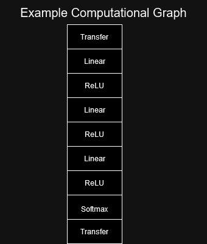
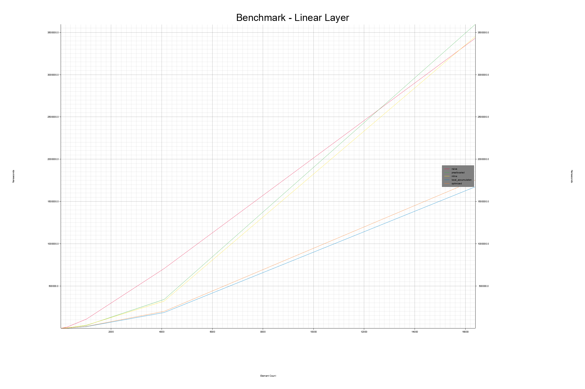
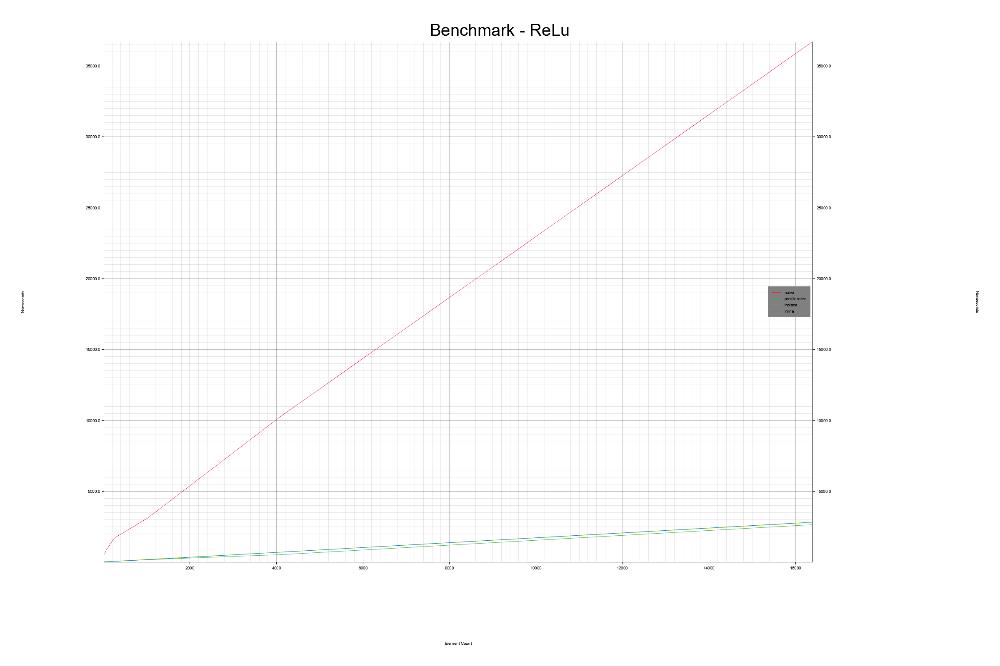
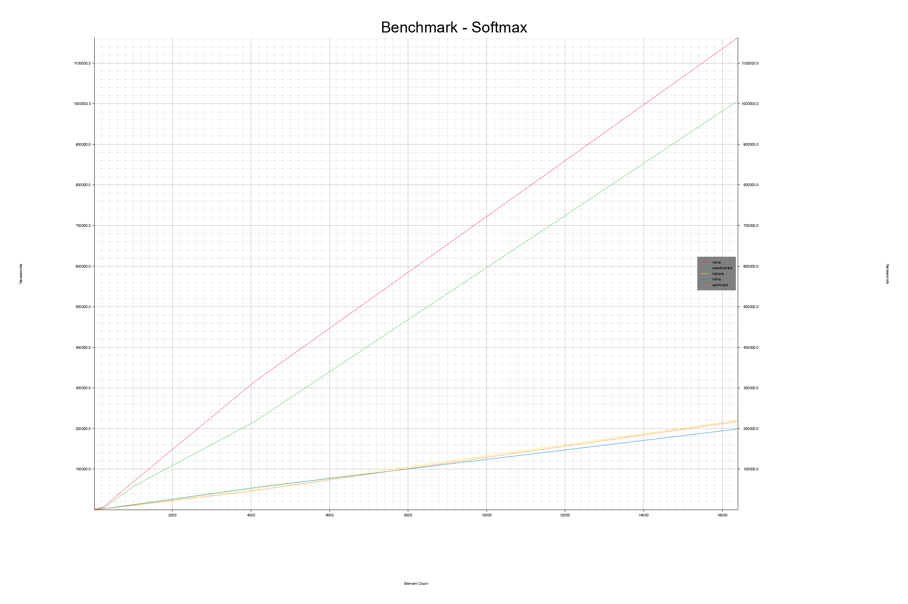
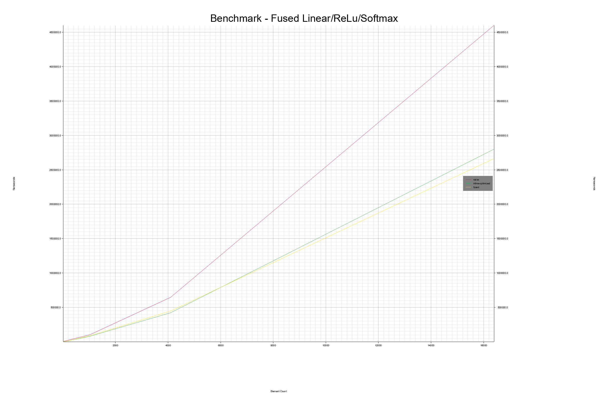

# 2️⃣ Computational Graphs
Conveying the importance of computational graphs to people who were probably using Python to
program neural networks was the motivation for doing this whole thing in the first place.
So now let's get to business.

Computational graphs are more or less a way to communicate the flow of your program.
It can allow a library or a framework to keep data at various levels of the memory hierarchy.
It can allow it to check that all of the dimensions fit for the data,
it can make assumptions about fusing nodes (combining them), remove redundancies and removed unused elements.  

Let's take a look at this defined network from PyTorch's own
[documentation](https://pytorch.org/tutorials/recipes/recipes/defining_a_neural_network.html).

```python
class Net(nn.Module):
    def __init__(self):
      super(Net, self).__init__()
      self.conv1 = nn.Conv2d(1, 32, 3, 1)
      self.conv2 = nn.Conv2d(32, 64, 3, 1)
      self.dropout1 = nn.Dropout2d(0.25)
      self.dropout2 = nn.Dropout2d(0.5)
      self.fc1 = nn.Linear(9216, 128)
      self.fc2 = nn.Linear(128, 10)

    # x represents our data
    def forward(self, x):
      # Pass data through conv1
      x = self.conv1(x)
      # Use the rectified-linear activation function over x
      x = F.relu(x)

      x = self.conv2(x)
      x = F.relu(x)

      # Run max pooling over x
      x = F.max_pool2d(x, 2)
      # Pass data through dropout1
      x = self.dropout1(x)
      # Flatten x with start_dim=1
      x = torch.flatten(x, 1)
      # Pass data through ``fc1``
      x = self.fc1(x)
      x = F.relu(x)
      x = self.dropout2(x)
      x = self.fc2(x)

      # Apply softmax to x
      output = F.log_softmax(x, dim=1)
      return output
```

In PyTorch the user does not fully create a graph, but if the user makes sure ```x``` is on the
GPU by calling ```x.to_device()``` all of the functions will be executed on the GPU until the
output is transferred back to the CPU. This reactive paradigm might be part of why the first
complete iteration of a PyTorch training loop will be signifcantly slower than the subsequent
loop. Not to mention all of the allocations behind the scenes for backpropagation.

If you use ```torch.compile()``` it will do something called tracing behind the scenes.
You don't need to worry about the specifics, but just know that it creates a computational graph
from the Python code above and then optimizes that code to run faster and/or use less memory.

So why does it need the graph? That is something the rest of this module will try to answer,
along with a really basic introduction to fusion, where layers are combined to be more efficient.

## What is a Graph?
A graph is [a type of structure](https://en.wikipedia.org/wiki/Graph_(discrete_mathematics)),
for our needs, a data structure. In s0 there is a more elaborate examination of the concept for 3️⃣.
So for right now, just give the link to graph's wiki page a quick look. You should get the gist just by
looking at a few of the images.

Once you have done this, just know, that the rest of this module won't actually use a real graph.
The graph we will concern ourselves with will be defined as being one way, unidirectional, and each
node can point to at most one other node. This reduces the entire graph to just being a list of operations
which will be executed sequentially.

## The Network We Want to Support
For illustrating how computational graphs can benefit your code we don't really need to support
a lot of operators. We need transfers to and from the GPU (eventually), a linear operator
(matrix-matrix multiplication followed by an addition), a ReLU operator (single call to a max function with 0)
and a softmax operator. The softmax operator is the most complex part, don't worry I will show you some
CPU code that is fairly easy to understand. The GPU version gets a bit complicated and is only constructed
in a fairly simplistic version.

<figure markdown>
{ width="300" }
<figcaption>
Our minimal computational graph example will only contain these 5 operations.
</figcaption>
</figure>

For the computation graphs we will use, note that due to the constraints of transfer first and last, and softmax
next to last, the only difference is the amount of linear and ReLU layers. Eventually, when we look
at fusion, new operators will be produced, linear-ReLU and linear-ReLU-softmax. We will only use
32-bit floating point, ```f32``` in Rust, as the data type.

<figure markdown>
{ width="300" }
<figcaption>
An example computational graph.
</figcaption>
</figure>

The code for the rest of the module can be found at ```m1_memory_hierarchies/code/computational_graphs/``` or
[online](https://github.com/absorensen/the-guide/tree/main/m1_memory_hierarchies/code/computational_graphs).

## What's in a Tensor2D?
First of all we are going to start on the CPU.
We are going to create a data type which will hold the data our operators consume on the CPU.
Let's call it ```Tensor2D```. Our 2D tensor will actually be a simple piece of one dimensional memory under the
hood and we will keep track of the number of rows and columns to find out how to access each piece of data.
If you are in the root directory for ```computational_graphs``` go to ```src/shared/tensor_2d.rs``` or
[online](https://github.com/absorensen/the-guide/blob/main/m1_memory_hierarchies/code/computational_graphs/src/shared/tensor2d.rs).

Start by taking a look at the definition of the ```Tensor2D``` struct at the very top. The ```derive``` stuff
at the top is asking some macros to automatically implement (derive) some traits (interfaces and behavior)
automatically. ```Clone``` means we can call a Tensor2D element as below -

```rust
let some_tensor: Tensor2D = Tensor2D::new(0.1, 8, 8);
let copy_of_some_tensor: Tensor2D = some_tensor.clone();

```

This creates a complete and total copy of ```some_tensor```. If we manipulate or move ```some_tensor```,
```copy_of_some_tensor``` will not be affected as they no longer have anything to do with each other.

Next, take a look at the ```new``` function. In it we create a new ```Tensor2D``` by creating a new
```Vec<f32>``` with size ```row_count*column_count```. Each element is given a value of ```scale*index```.
This is just for testing purposes so I found it useful for this to not be all zeros and not all random numbers.
This allows us to verify that the GPU implementations are functionally equivalent to the CPU implementations.

We don't need to otherwise relate to the values of ```row_count``` and ```column_count```. Even if we implement
a two dimensional structure on top of a piece of one dimensional memory, when we are iterating through all
elements, such as we do when setting all of the elements to some value or accumulating the sum of all elements
we can do away with the two dimensional stuff. Keeping up that illusion unneccesarily induces extra cost
in the form of more time and code spent on control flow statements like ```for-loops``` and ```if-statements```.

## Implementing Operators
In this section I will be going through various implementations of the three operators and their fused variants
and show benchmarks to show you how big of a performance impact these sort of first guess optimizations can have
even without profiling or microoptimizations.

### Linear
There's some dimension checking functions, you can just ignore those. They use ```debug_assert``` statements
to raise an error if the dimensions of the tensors given to a linear layer function don't match. ```debug_assert```
is the same as an ```assert``` statement, except it is only run in debug mode. I did it this way to incur only a small
hit to performance. You probably passed the ```linear_layer``` function on the way down, it just acts as a wrapper
around the ```linear_layer_preallocated``` function. If you haven't already allocated a tensor to use as output,
it will make one for you. If you do this a lot however, such as in a loop, you should be using the preallocated
version to not have memory allocations in your loops.

Finally, let's go down to the ```linear_layer_preallocated``` function. There are three main sections. One is
the call to the ```debug_assert``` function from earlier, to check for valid input and output dimensions, the
second is the matrix-matrix multiplication which needs three whole for-loops and finally the bias section. Note
the use of linearized accesses, if you need a reminder what that is all about, go back to ```m1::s0::The Vector```.

It's not too bad, but we could do better, although we won't do more efficient implementations of matrix-matrix
multiplication, note that the read accesses of the weights tensor is strided. We could have implemented that some
tensors could be transposed, but you get the point. So we have a triple for-loop and a double for-loop in our
linear operator. Try to think, based on the contents of the last couple of sections, what would be good first
optimizations for this function?

While you think about that in the back of your mind, I'll take a quick detour to introduce a very simple but
finnicky concept - inlining!

Inlining in Rust, and most other languages, is done via an annotation to the compiler. It is usually more of a hint
or request than an actual instruction. In Rust it looks like the derivation of traits we saw earlier -
```#[inline(always)]```. In that case it actually is more of a command. There's other variants you can put inside
the parantheses like ```#[inline]```, which is more of a suggestion, or ```#[inline(never)]```. Inlining
is basically taking all calls to that function and substituting it with the code from the function. This is
largely good for very small functions, such as if we made a function for making our linearized array accesses
prettier to look at, but for large functions it either does nothing or makes the performance worse. So, in general,
unless you were trying to examine the concept of inlining like we are now, you should stick with ```#[inline]```
and suggest inlining to the compiler, without demanding it. The compiler is pretty smart and will usually figure
out what is best. As you will see in the function ```linear_layer_preallocated_inline```, the function itself
is not different in any way.

Next up is the function ```linear_layer_local_accumulation```. Now it's memory hierarchy time! While I didn't
get rid of the strided memory access of the weights tensor, I removed some of that control flow overhead,
by linearizing the bias part. Now it is just a single for-loop, instead of two, because the dimensions of
the output and bias tensors match, and there are no transformations to be made. So we get to just iterate
through all elements. I also elected to not accumulate the result of each output element directly in the output
tensor. Instead I accumulate in a local variable, which will hopefully be kept in a register.

Think back! Where is the register located? And why can it be problematic to accumulate the sum in the output tensor?

The bias is the same. But that does mean we are writing to the same output element twice. Let's move the bias
calculation into the matrix-matrix multiplication loop. ```linear_layer_optimized``` moves the bias to just
before the writing of the accumulated result to the output tensor. If the bias calculation was a lot larger, this
might not be faster. In some cases for highly complex loops, it can instead make sense to separate them into
more loops, which is a process called ```loop fission```. I have only used a small subset of loop optimizations,
but you can read about more ways of optimzing a loop [here](https://en.wikipedia.org/wiki/Loop_optimization).

Ok, so try and run the code locally! To begin with go to the file ```src/lib.rs```. Comment out all
of the lines within and including the ```if configuration.compatible_gpu_found {``` line. Then in your terminal
navigate to the root folder, the one containing the ```src``` folder, and write ```cargo run --release```. Your
computer will now run a bunch of benchmarks relevant to the rest of this section. You can find the output
in ```computational_graphs/outputs/benchmarks/stack```. The one that should have been generated on your computer
that we want to look at now is called ```linear_layer_cpu_benchmark_stack.png```. If you weren't able to run
it locally, don't worry, I got you covered!

<figure markdown>
{ width="800" }
<figcaption>
Benchmarking linear operator functions on the CPU.
This benchmark was run on my laptop boasting an Intel i7-1185G7, 3.0 GHz with 32GB of RAM. The operating system was
Windows 10. The L1/L2/L3 caches were 320 KB, 5 MB and 12 MB respectively.
</figcaption>
</figure>

Huh, it seems our loop fission didn't really matter in the grand scheme of things!
The graph is quite high resolution to allow you to zoom in. The x-axis is the size of the tensors. Only NxN matrices
are used. The y-axis is time in nanoseconds averaged over 1000 runs. Note how the
lines are piecewise linear. There are two points where all of the lines get quite a bit slower and scale worse
with the size of the tensors. Why do you think that is?

You guessed it! You are seeing the size of the tensor becoming too big for the different caches! It looks like the
last bend happens at 4096 elements. This corresponds to a 64x64 matrix. 4096 elements of 32-bits, or 4 bytes, each
corresponds to 16384 bytes, or 16 KB. We have 4 of these tensor structs, so we should have total allocations of
64 KB just for that data and then add in all of the other memory used by the application and everything else
running on the laptop at the time. But then again, the sampling is quite sparse. You can try and add more data
points and see if you can narrow down the sizes of your caches.

This might be a good time to experiment with changing the values in ```lib.rs``` for

```rust
let loop_count: usize = 10;
let loop_range: Vec<usize> = (2u32..8u32).map(|x| 2usize.pow(x)).collect();
```

```loop_count``` is how many measurements are made per data point. ```loop_range``` is a vector of matrix sizes.
In this case, the first element is 4, so the first measurement will be done with matrices sized 4x4.
Currently, it takes a range between 2 and 8 (not including 8) and yields a vector of sizes of 2^N.
So 4, 8, 16, 32, 64, 128. If you wanted all values in the range of 0 to 100 you could write

```rust
let loop_range: Vec<usize> = (0..101).collect();
```

You can zoom in on these parts of the graph by modifying ```lib.rs``` to just test values in these
interesting ranges. Like right around the size of the last bend.
Another thing to note is that only the versions of the linear operator that uses local accumulation
significantly outperform the naive version. One surprise is that keeping the bias outside of the
matrix-matrix loop, is better performing than moving the bias in. Sometimes it really is better to
keep things simple. So from now on, the ```linear_layer_local_accumulation``` version will be the preferred one.

### ReLU
Next up, we have the ReLU function, which is embarrasingly simple. It returns the maximum of two numbers.
One of the numbers is zero. Done.

So, move your way down to the ```relu``` and ```relu_preallocated``` functions. Here I also completely flatten
out the two dimensional tensor to save on the amount of time spent on control flow vs. actual computation.
But then we get a new variant. The ```relu_inplace``` function. Because it is possible to do the ReLU operation
directly on the input array, let's try that variant as well and see what the effect is. Finally, we have
```relu_inplace_inline```. This function is definitely small enough that it might benefit from inlining.

So now go back into the same folder where you found the linear benchmark output and look at what your computer
could crunch out. Alternatively, if you couldn't run it, I got you covered here.

<figure markdown>
{ width="800" }
<figcaption>
Benchmarking ReLU operator functions on the CPU.
This benchmark was run on my laptop boasting an Intel i7-1185G7, 3.0 GHz with 32GB of RAM. The operating system was
Windows 10. The L1/L2/L3 caches were 320 KB, 5 MB and 12 MB respectively.
</figcaption>
</figure>

Note the huge difference between the naive version and the other ones. Why do you think there is
this huge difference?

You guessed it! All of the other functions have either preallocated the output matrix, or do the
operations inplace. Since the ReLU operation is so simple, it becomes easily dominated by allocation
and memory costs. The difference between the preallocated version and the inplace version is not as big, but
still substantial enough to warrant the optimization. Inlining on the other hand didn't make a big difference
in this case. It is still doing one read and one write after all.
Go back and look at the how much was gained by inlining the much more complex linear operator
in the previous benchmark! Go on!

Inplace operations are also available in PyTorch. The ReLU actually has a flag for the
[inplace version](https://pytorch.org/docs/stable/generated/torch.nn.ReLU.html).

### Softmax
Now let's look at the softmax operator. It isn't that complicated, except as we'll see when we talk about
the GPU version, the max and sum values are actually non-trivial to implement on a GPU using more than a
single work group (a group of threads).

Anyways, head down to ```softmax``` and ```softmax_preallocated```. In ```softmax_preallocated``` we
have 3 distinct sections. The first section is finding the global maximum value. Once that is found
a modified sum reduction is performed using the max value. Finally, the sum and max are used to calculate
an offset value which is used to modify all of the values in place. The sum of all the values should
now be 1. Note that we only use one for-loop for all of the elements as softmax doesn't care
about dimensions. This allows us once again to cut down on control flow overhead. Once again,
we create an inplace and an inline-inplace version. Try and look at the code for a second
and go through why we can an unproblematic inplace version of softmax.

Got it?

Finally, checkout the results in your output folder! Or if you couldn't run them locally I have
some here -

<figure markdown>
{ width="800" }
<figcaption>
Benchmarking Softmax operator functions on the CPU.
This benchmark was run on my laptop boasting an Intel i7-1185G7, 3.0 GHz with 32GB of RAM. The operating system was
Windows 10. The L1/L2/L3 caches were 320 KB, 5 MB and 12 MB respectively.
</figcaption>
</figure>

As can be seen, the inplace and inline versions beat the naive and preallocated versions by an extremely wide
margin. The different between the inplace and inline seems quite small, but the inplace version seems to
consistently beat the inline version.

### Fused
Finally, let's see what we can do with combining the operators with fusion! First take a look at the functions
```linear_layer_local_accumulation_relu``` and ```linear_layer_optimized_relu```. In these two I combine
the linear operator with the ReLU operator. In the local accumulation variant, the bias and ReLU are handled
in their own distinct loop (loop fission). In the optimized variant, they are in the same loop as the
matrix-matrix multiplication.

Now let's add in the softmax operator. Take a look at ```linear_relu_softmax_fused_fission``` and
```linear_relu_softmax_fused```. In the fission version, the max value is found in the same loop as
the bias and ReLU computation. In fused version, bias, ReLU and max are all moved into the ending of the
matrix-matrix multiplication loop.

Finally, checkout the results in your output folder! Or if you couldn't run them locally I have
some here -

<figure markdown>
{ width="800" }
<figcaption>
Benchmarking fused operators functions on the CPU.
This benchmark was run on my laptop boasting an Intel i7-1185G7, 3.0 GHz with 32GB of RAM. The operating system was
Windows 10. The L1/L2/L3 caches were 320 KB, 5 MB and 12 MB respectively.
</figcaption>
</figure>

As can be seen the naive version, which is just successive function calls to linear, ReLU and softmax operators
is massively outperformed by the fused linear-relu-softmax operators, with the fissioned version with bias
outside of the matrix-matrix loop winning out. Of course the linear-relu versions are the fastest,
as they don't do softmax, but between the two of them it is again the version without the bias calculation
at the end of the matrix-matrix loop which wins ever so slightly.

It's hard to make a general conclusion based on that, without going a lot deeper, but in any case,
you should always test and measure! Now, you can either continue on reading the 3️⃣ material
or go to the next section to get a general introduction to GPUs. We will be using the GPU on
your laptop, with no CUDA involved, to see if we can make this even faster.

_________________

## 3️⃣ Testing Operators
All of the operators have been tested to be numerically equivalent. Rust has some nice
test facilities to help with this. If you look at the file next to ```tensor2d.rs```,
called ```tensor2d_test.rs```, you can see a bunch of tests. This used to be in
```tensor2d.rs```, but I moved it to this file during a clean up, because the file
was getting massive.

The generic way to run these tests is writing ```cargo test``` from the same spot you
would otherwise write ```cargo run --release```. This works just fine for all of the
CPU based tests. The testing system launches lots of tests in parallel to speed up
the amount of time it takes to run the tests. As we will see later, this parallel
test launch can create some issues when testing our GPU functions.

## 🧬3️⃣ Graphs in Graphics/GPU Programming
Computational graphs are even making their way into the way you can program the GPU!
Ways to define computational graphs have been added to
[DirectX12](https://devblogs.microsoft.com/directx/d3d12-work-graphs-preview/)
and [Vulkan](https://gpuopen.com/gpu-work-graphs-in-vulkan/).
This development seems to be lead by game and graphics workloads being increasingly
compute shader driven.
