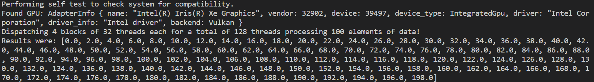

# 2️⃣ Intro to GPU's
Now, I'll just give you a quick introduction to GPU's as the next section is about immediate mode
GPU computation.

GPU's are fairly ubiquitous at this point. They started off as purely for graphics, but
around 2008, enough researchers had tinkered with workarounds to use them for general
computing, that Nvidia put out CUDA, opening up GPU's for more general usage. GPU's still do lots
of graphis, but they are no longer opaque black boxes and even graphics API's such as OpenGL, Vulkan,
Metal and DirectX have opened up. With modern graphics API's you don't even necessarily need a graphics output
to use them. You can just use the pure compute capabilities. This guide won't get into graphics, except
for the graphics specialization.

Ok, so anyways, GPU's are pretty hot stuff right now as the software support becomes deeper and deeper,
the hardware increasingly has hardware support for neural network specific operations and ChatGPT has
increased the hype and demand for AI to exasperating levels.

You can think of the GPU as an expansion of the memory hierarchies we have been examining earlier.
It is not running in lockstep, and you have to program more things explicitly, while also changing
your mindset about how programming works. Memory transfers to and from the CPU and GPU will be
relatively explicit, you have explicit control of a part of the L1 cache, you have start programming
in a warp oriented fashion and if-statements become quite dangerous.

If the CPU, with its numerous cores is like a team of highly skilled specialists building a car, sure,
they can build an amazing car, they can adapt to changing circumstances quite well, they can act independently,
then the GPU is like a factory. Each path and process has to be carefully optimized, they might each only deal with
a very small piece each and people have to work in lockstep. But. Their throughput is unmatched.

At level 3️⃣ I will go into more detail as to how to actually write GPU code, but the guide is set up using
Rust and a GPU API abstraction layer called [wgpu](https://wgpu.rs/). You don't need to understand how it works
right now, but it means that you should be able to run all code, including GPU code, on your platform, even if
it's made by Apple or AMD.

## GPU Hardware
First off, when dealing with the GPU, you will have to manipulate the GPU from the CPU with commands
like "allocate this much memory", "transfer this memory from the CPU to GPU", "execute this shader/kernel" and
"synchronize". These are all done in whatever language you are writing in on the CPU side, except for the
actual program the GPU has to run. This is distinct from the GPU API, some GPU API's even accept shaders
written in multiple shading languages, as they can either be transpiled (translated) from one language to
another, or they can be compiled to an intermediate representation, such as SPIR-V, which they can then ingest.

But once we have built up all of these commands, at least if they are non-blocking, as in the CPU program won't
advance until the command has completed, we have to actually submit them to the GPU. We do this with a
synchronization. The commands may/may not have already been submitted, but if you call a synchronization
function, the CPU-side code will block and wait until any and all submitted commands have executed on the GPU
and the GPU sends the all-clear signal in return. Imagine you are at a horse track. You have to give instructions
to a jockey on a race horse. You stand on the periphery of the big oval race track. You tell the jockey to make
some adjustment and do a lap. The horse first has to accelerate and then once it nears you slow down and you can
talk again. What would be more efficient was if you could leave notes for the jockey to pick up
whenever he was coming around and the horse could just continue at speed. In some API's the GPU
can just be set in motion and then whenever you have a change to the loop it is running, adjust
or change. Or you can set work in motion and come back at a later time, whether the work might be done.

### Transfer
When transferring memory, you should have the following model in mind, nothing gets transferred without a staging
area. When transferring from CPU to GPU, at least in the CUDA programming model, it will pin an area in memory.
That memory won't be movable until it is unpinned. You basically transfer some memory from say, a vector you
want transferred to the GPU, to this pinned memory staging area. That pinned memory area means the GPU
can work in peace without interruptions. In CUDA, if you don't explicitly do it, CUDA will create a pinned memory
area and do it for you. If you do it yourself and optimize this process you are likely to see around 2x improvement
in transfer speed. The same thing happens on the GPU, a staging area visible from the CPU is where the transferred
memory is stored, and then moved from the controlled area to the rest of GPU memory, where the GPU is free to do
what it wants with it, without interruptions and guarantees.

### Threads, Warps and Blocks
Threads are sort of like a CPU core, except a CPU core is a physical entity, whereas a thread is more like
a set of variables (think back to the stack and function calls) which is following its own set of instructions.
Thread 1 could be running program A with various states in registers and local variables X. It makes a call
to something expensive, like a cache-missing memory access. While waiting, thread 1 is swapped for thread 2.
Its state is of course saved, but thread 2's program B and state Y are swapped in for it to do some work.
This keeps the CPU core itself occupied with work.

Threads on a GPU, will usually be executing the SAME program, unless several calls are overlapped, but let's
just focus on you having called a single operation. In that case all of your threads will launch, running
the same program. They might however, go down different branches (think if-statements!), but this more expensive
on the GPU and CPU, and should in general be avoided as much as possible. Each thread will have its own local
variables. Threads on a GPU are launched in groups. Depending on the platform and the API they will be
called something different. In wgpu, which is what we will be using, it is called a workgroup, while
in CUDA terminology it is called a warp. On Nvidia GPU's it will be at most 32 threads per workgroup
and on AMD it will be at most 64 threads. The "at most" might seem a bit weird, but there is something called
register pressure. All of the execution units that can run those 32 or 64 threads at the same time, share
a lot of the same physical memory, so if your program uses lots of memory, you might have to decrease
the amount of threads to have enough memory to run your program.

Anyways. Once you decided to write a matrix-matrix multiplication shader, you need to figure out which threads
are gonna go where. In that case, I would begin by launching 1 thread for every output element.

When programming for a GPU you have some maximum amount of threads you can launch. This is usually
defined in three dimensions. Yes! You can define these threads in three dimensions. It doesn't actually
have much of an effect, but it makes sense to tailor how you launch threads to your problem area.
If you are performing image processing or matrix multiplication, by all means, launch a 2D grid.
If you are summing an abitrary list of numbers, a single dimension will probably suffice.

So, we should launch a 2D grid, matching the output elements of our problem. Next up,
how do know which thread does what work? Each thread will usually begin its program
by asking built-in variables, which thread it is. This can be which thread it is within its
own workgroup, or it could be globally. Once it knows that, it should usually check whether
it is within legal bounds of the problem. We almost always want n^2 threads in our workgroup,
and it wouldn't be very flexible if the problem size always had to match exactly.
So usually, you should launch too many threads and then have an if-statement following
the thread ID calculation. If within acceptable range, do work, otherwise, don't do work.

It cannot be assumed that all work groups are running concurrently. The GPU might need to launch
waves of work groups because there aren't enough physical execution units.
As such, we can only synchronize between threads inside the warp.

### GPU Memory Hierarchy
The memory hierarchy on a GPU, here as exemplified by the Nvidia H100, which is a very expensive data center GPU
and most definitely not the one residing in your laptop, looks a lot like the memory hierarchy on the CPU.
But the bandwidth (how much data per second) internally on the card is a lot higher than on the CPU. All of
the streaming multiprocessors share the L2 cache and each streaming multiprocessor shares an L1 cache. On
Nvidia GPU's the streaming multiprocessor is a number of, in this case 4, units which can each execute a
work group, or in Nvidia terminology, a warp.

<figure markdown>
{ width="700" }
<figcaption>
The layout of a H100 GPU. Note that connectivity to the memory (HBM3) is on the left and right sides.
<a href="https://developer.nvidia.com/blog/nvidia-hopper-architecture-in-depth/">
Image credit </a>
</figcaption>
</figure>

Take some time to study these two diagrams and think about how data moves first from the CPU,
to the GPU's main memory, then to the L2 cache, then to what streaming multiprocessor which needs its L1 cache
until it finally is loaded up into the registers of the 32x4 threads executing on different, but adjacent, segments
of the same data.

<figure markdown>
{ width="400" }
<figcaption>
The layout of a single Streaming Multiprocessor. It can execute 4 work groups or warps at a time.
<a href="https://developer.nvidia.com/blog/nvidia-hopper-architecture-in-depth/">
Image credit </a>
</figcaption>
</figure>

The threads accumulate their data into their own registers until they are done and write the
result to main memory. The CPU waits for the GPU to be finished, until the GPU is, transfers to the CPU and
signals that it is finished.

It's not always as clear cut, though. If you are using a laptop, you probably have an integrated graphics card.
The CPU and GPU coexist and share the same memory. There may be sections where there is higher bandwidth than
just normal CPU-based memory, but overall the integrated GPU has access to the same memory the CPU has.
This makes for faster transfers, but probably slower overall computation. This has become quite useful
recently with most consumer grade GPU's having around 8 GB of memory and locally run neural networks
like diffusion models easily being able to use more than that. A desktop GPU with more than 16GB of RAM would
probably still outperform an integrated graphics card with 16GB of RAM available, but it would be very expensive.

## 3️⃣ Introducing wgpu and wgsl
The guide will for all GPU purposes make use of the graphics library wgpu, but only the compute parts.
wgpu is based on the WebGPU spec, which is supposed to be the new web GPU API, as well as not being particularly
creative with their naming, the actual support in browsers for WebGPU is nascent. Chrome supports if you fiddle
with some settings, but for most systems, especially if you aren't actually running in a browser, wgpu
will default to using different, more powerful backends. For example, at the time of writing this,
I am using an HP laptop, with an Intel integrated graphics card running Windows 10. Whenver I run a program
with wgpu, wgpu tells me it has chosen Vulkan as my current backend. We could of course just write Vulkan,
but it would be a bit more complicated, as Vulkan is slightly more low-level than wgpu, but it would also
be more powerful. But attaining ultimate performance isn't the purpose of the guide. It's to get as many
people as possible started as soon as possible. It has to run on an Apple computer and it has to be easy to
install. So, wgpu it is. While any API which has to cover as many platforms as wgpu does will usually be hampered
by the lowest common denominator, it is possible to query wgpu for hardware support for various features, such
as fp16. While wgpu is still quite new, it has some exciting features on the way, such as a hardware accelerated
ray tracing extension.

The default shading language (the language you use to write the code the GPU will run) is wgsl, which
was defined along with the WebGPU specification. It is possible to use other shading languages, such
as glsl and hlsl, which also have more info and general documentation, but because of the increased code
complexity in building the files to SPIR-V and then ingesting them, I elected to just use what was simplest.

We can add wgpu to a project by going into the ```Cargo.toml``` file in the root directory,
and under ```[dependencies]``` write the line ```wgpu = "*"```. It will pull down the latest version of wgpu.
You can of course also get a specific version of it, such as ```wgpu = "0.16.3"```.

## 3️⃣ Basic GPU Programming
GPU programming, as has previously been mentioned, has two major elements. Host (CPU) code and device (GPU)
code. We'll start off with the basics of the host code and then move on the GPU code. Just enough
for you to be able to read the following sections and understand what is going on in this entire module,
as it doesn't go into the finer details of GPU programming, but is centered around a GPU-centric paradigm.

The rest of this section will be make use of the code location at ```m1_memory_hierarchies/code/gpu_add/``` or
[online](https://github.com/absorensen/the-real-timers-guide-to-the-computational-galaxy/tree/main/m1_memory_hierarchies/code/gpu_add).
Make sure to go and actually read the code. It is full of comments! And they're made just for you!
If you want to learn more about wgpu you can visit [Learn Wgpu](https://sotrh.github.io/learn-wgpu/).

Be sure to read through the code! Do this before you read the rest of this section, which will go into greater
detail.

Starting in the ```main``` function, first we initialize the environment logger with ```env_logger::init()```.
This will get us more helpful feedback from wgpu. This should only happen once in your code, so by putting it
as the very first line, we should be sure that it shouldn't need to happen anywhere else.

Next up, we call ```pollster::block_on(self_test())```. The ```self_test``` function, is a function I made, and
use elsewhere to make sure your system is compatible and to print the system info so you can see what GPU is being
found and what backend is being used. ```pollster::block_on``` allows us to call asynchronous code from a normal
function. If you don't remember what asynchronous means, just think of it as being non-blocking. Meaning, we can
launch an asynchronous function and just continue on to the next line of code. But the way we do this is different
depending on whether we are inside a normal function or an ```async``` function. An ```async``` function definition
example - ```pub async fn self_test() -> bool {```.

If we are in a normal function and we call an ```async``` function, we have to wait for it to complete. As in, block
on the function call, which is of course ```pollster::block_on()```. Inside the ```async``` function it self it can
either block on async function calls by using ```await``` - such as ```let result = async_function().await;``` or
you can store what is known as a future. We could set in motion the loading of a number of files, and then once we
were done and actually genuinely NEEDED to use the files for something, ```await``` on the future. The ```async```
function, when called from a normal function also returns a future, but we can't use ```.await``` on it.

```rust
pub async fn load_four_files(path_a: &str, path_b: &str, path_c: &str, path_d: &str) -> (File, File, File, File) {
    let file_future_a = load_file_async(path_a);
    let file_future_b = load_file_async(path_b);
    let file_future_c = load_file_async(path_c);
    let file_future_d = load_file_async(path_d);

    let file_a = file_future_a.await; // Block on the future
    let file_b = file_future_b.await;
    let file_c = file_future_c.await;
    let file_d = file_future_d.await;

    (file_a, file_b, file_c, file_d)
}
```

Ok, so why do we need ```async``` when dealing with the GPU? In some cases, we don't care about synchronization.
We just want to keep transferring data to the GPU as fast as we can get it, the GPU might output to the display
or we might get some data transferred back, but if we are doing this in a real-time setting, we might not care
to synchronize, as in block, and we just need things when they are ready. Anything to do with gpu - ```async```
will be involved. At least in Rust.

Let's move on. We set up our CPU-side data. This is a simple vector addition, and I elected to make the data
in a way that was easily verifiable as correct for humans. Input A and B are just vectors of 32-bit floats
with values equal to their index. The correct result in the output vector should of course be double the
index value then.

Finally, we call ```initialize_gpu()``` and block on it. Let's go into that function!

First we get an ```Instance```. The ```Instance``` is a wgpu context which we will use to get ```Adapter``` and
```Surface```. The ```Adapter``` corresponds to your GPU. We specifically request the adapter with high performance.
If you are on a system with more than one GPU, such as a laptop with an integrated GPU, which shares memory with
the CPU and a more powerful dedicated GPU, it should try to get access to the dedicated GPU. We also request
```None``` for ```compatible_surface```. Surfaces are what you would render to if you were doing graphics. Think
of an image with extra steps which you could show on your display. If we don't need to do graphics, not having one
is less work. It also means we can run on data center GPU's, which might not even have a display port. So we just
get the ```Adapter```. We use the ```Adapter``` to get ```Device```, which will be our handle to the GPU
from now on. Whereas the ```Adapter``` is more of a raw connection, where we can't do much with it, the
```Device``` is a handle that has some guaranteed features. The ```Adapter``` tells us what features we can get.
Once those features are guaranteed, it is much easier for wgpu to open up for more functionality with
the ```Device```. We actually don't need the ```Adapter``` after we get the device,
but I keep it around in the GPUHandles for you to tinker around with in auto-complete to see what it can
do. We do need the ```Device``` though. We also need the ```Queue```. The ```Queue``` is where we
can submit the work we want the GPU to do.

Note that when defining our ```DeviceDescriptor``` for getting a ```Device``` that lives up to our needs
our current requested ```features``` is ```wgpu::Features::empty()```. We just want the absolute basics.
But we could request, or at least see whether we could get them, features like 16-bit floating point support.

Now back to the ```main``` function!

We now have our bundled GPU-related handles. Now we calculate how many threads we need to launch for our
problem size. ```let element_count: usize = 100;```, so we need to launch AT LEAST 100 threads if each thread
only processes one element of our problem. Which it does in our simplified case. Given that we would like to fill
up our work groups, I have elected to use 32 threads per work group. ```let block_size: usize = 32;```.
Given that the register pressure is likely very low for our shader, this should be no problem. Finally, we
calculate how many blocks to launch. This simple calculation is found all of the place when doing
GPGPU programming. ```let launch_blocks: u32 = ((element_count + block_size - 1) / block_size) as u32;```.
The basic premise is that we add one element less than the full work group size and then use integer division
to make sure we always have at least as many threads as we need. In the worst case of a work group size of 32,
we will have a work group at the very end of the vectors with 31 idle threads doing nothing.

Next up, we compile our shader code ```add_vectors.wgsl``` with ```create_shader_module()```.
Compiling shaders is quite expensive, so if you are programming a bigger system than this, you might want to
save the compiled code or do it as a build step and load it from disk when needed. Once we have compiled
our shader code we can create a compute pipeline with a specific entry point. The entry point is just the function
that will be called when dispatching the shader call later on. Once we have a ```ComputePipeline``` we can
begin doing our bind group layouts. In CUDA you can pass device side pointers to your CUDA functions
when dispatching. Or phrased differently, when using CUDA you can pass along memory addresses for buffers you have
explicitly allocated on the GPU. When using the graphics APIs the most basic thing to do, if you are
not going bindless, which is... well, don't worry about it, is to use bindings. There is a certain amount of bind
slots available in a shader depending on the API and perhaps the system. What can be a bit tricky is the binding
slot you declare on the CPU for buffer X, has to match the exact binding slot in the shader. E.g. if you bound
your input buffer to binding slot 0 on the CPU, it has to be bound to binding slot 0 in your shader code.
Additionally, the compiler will complain if you don't use that buffer in the shader. Finally, you can have multiple
sets of bindings in the same shader. These are called bind groups and each has N binding slots.

When I created the ```GPUVector```s earlier, the ```new``` function allocated a storage buffer, which is visible
to the shader and transferred the contents of the given vector to the GPU. This can be done more effectively, but
it's a nice and easy way to start things off. We don't have to keep track of whether we remembered to transfer
our data to the GPU or not, which makes sure we don't use initialized data. In the case of the output vector, we
have also allocated a ```staging_buffer``` to more explicitly transfer data back to the CPU. This ```Buffer```
has also been flagged as readable from the CPU.

The ```storage_buffer```s we have created, when creating the ```GPUVector```s from before, can be bound. I
add these binding references to a vector and send them to a convenience function ```create_bind_group()```, which
binds the array of bindings in order. Do note that we don't specify what can and cannot be done at this step. It
was specified at the creation of the ```storage_buffer```s and it will be specificed locally in the binding of
the buffers in the shader.

Once we have our bindings set up, we create a ```CommandEncoder```, which we get from ```Device```.
The command encoder is a buffer of commands. We can add stuff like render and compute operations, their sort of like
a collection of operations and state, and transfer operations. The command encoder needs to be finished, before it
is submitted to the queue. Remember the ```Queue``` we got earlier? This is what it was for. We submit
finished ```CommandEncoder```s to our ```Queue```, which submits the jobs to the GPU. For this specific program
we add two commands to the ```CommandEncoder```. We dispatch our compute shader, enclosed in a ```ComputePass``` and
launch the appropriate number of threads. Note also the ```label``` field. This field permeates wgpu usage. It is
mostly for debugging. It helps us identify what is causing an issue. Once we have finished our ```ComputePass```,
due to it going out of scope, we add a transfer operation. We use the ```staging_buffer``` on our ```output```
vector, to read the output back to the CPU. Then we finish our ```CommandEncoder``` and submit it
to the ```Queue```.

We then setup a ```oneshot_channel```. Don't worry too much about this. It is a connection which can only be used
for sending data once. We map the ```staging_buffer``` and send its data using the sender/receiver pair. Once
we have done this ```map_async``` call, we wait for the GPU to be finish all operations currently in its queue.
Once it has finished we block on the receiver. Until the receiver sends the ```Ok``` signal we wait. Once we get
it we retrieve the data. This is raw data in bytes, ```u8```, which we recast to the type we know it is, which in
this case is ```f32```. We do a bit of clean up, and don't you know it, that's the program!

<figure markdown>
{ width="600" }
<figcaption>
Adding our two vectors, it should be easily verifiable that it is correct.
</figcaption>
</figure>

Maybe now might be a good time to go back to the code and try to run through it yourself again.

## 3️⃣ Remove the loop where, you say?
When writing GPU programs, you should usually start writing a CPU-based program. Once that works, you have
something to verify your GPU program against. Often the part of your program that you want to offload to the GPU,
will have loops. For example, in a vector addition snippet you might have -

```rust
for index in 0..ouput.len() {
    output[index] = input_a[index] + input_b[index];
}
```

When transferring your program to a GPU shader, as a way to get comfortable with thinking about this sort of
parallelism, you should start with writing a single threaded version on the GPU. You can do this by dispatching
a single thread ```cpass.dispatch_workgroups(1, 1, 1);```. It WILL be slower than the CPU
version, but it allows you to get all of the transfers and synchronizations out of the way first. Once you have
done that, and you have verified that it works, mind you, you can start adding, or rather removing dimensions.
You do that by removing one of the for-loops in your code and replacing it with added dimensionality in your shader
dispatch. So in your first version of your vector addition shader, it might look like this sketch (don't know if
it compiles) -

```rust
@compute @workgroup_size(32, 1, 1) 
fn main(
    @builtin(global_invocation_id) global_id: vec3<u32>,
    ) {
    let thread_id: u32 = global_id.x;
    
    if (thread_id < 1) {
        for (var index: u32 = 0u; index < dimensions.element_count; index += 1u) { 
            output[index] = input_a[index] + input_b[index];
        }
    }
}
```

When that works, you can begin thinking about how to remove that pesky loop. You do that by removing a dimension
in your shader, but adding one in your dispatch and then making accomodations in your shader. We can take that
and transform it by instead dispatching more 1D threads: ```cpass.dispatch_workgroups(launch_blocks, 1, 1);```.
Then we change the shader to have each thread work on a single element - 

```rust
@compute @workgroup_size(32, 1, 1) 
fn main(
    @builtin(global_invocation_id) global_id: vec3<u32>,
    ) {
    let thread_id: u32 = global_id.x;
    
    if (thread_id < dimensions.element_count) {
        output[thread_id] = input_a[thread_id] + input_b[thread_id];        
    }
}
```

If there had been more dimensions we could have continued expanding and removing dimensionality. We can continue
until the third dimension, usually you can launch less threads in the third dimension than in the first two. You
also have to remember to check whether the thread is outside of the valid range for each dimension. You
should always look up for your graphics cards and your GPU API how many threads you can launch. You might have to
break it into several passes. It's not actually quite this simple, as, well you remember how we learned stride
had a negative impact on performance earlier? Well, that is not quite the same on GPU's. 

## 3️⃣ Coalesced Accessing and Strides
Because of the way threads and work groups share memory on a GPU, and each thread executing the same line of
code at the same time, if thread A calls for memory at indices 0, 1, 2, 3 and thread B, which is right next to it
in the same work group, calls for indices 4, 5, 6, 7, they will be asking for two different cache lines at the
same time. Imagine the whole work group doing this at the same time. They will all be waiting, while
requesting different cache lines. What is normally faster, is if, given a work group size of 32,
thread A calls for indices 0, 32, 64 and 96, with thread B calling for indices 1, 33, 65 and 97. This allows for
the work group to call for a minimum of cache lines in lock step and each getting a piece of the cache line.
This is called *coalesced accessing* and if you ever say that to a GPU programmer, you will see a faint smile on
their face. Think of a jigsaw puzzle, where the pieces are slowly being adjusted.
Eventually, they all snap into place. All of the pieces fit exactly right.

Here's a small example, if we for some reason were intent on turning our vector addition shader into
2D matrix addition, but we were deadset on keeping the thread grid for our dispatch one dimensional we
could do something like this -

```rust
const BLOCK_SIZE: u32 = 32u;
@compute @workgroup_size(32, 1, 1) 
fn main(
    @builtin(global_invocation_id) global_id: vec3<u32>,
    ) {
    let thread_id: u32 = global_id.x;
    
    if (thread_id < dimensions.first_dimension_count) {
        for (
            var index: u32 = thread_id; 
            index < dimensions.second_dimension_count; 
            index += BLOCK_SIZE
        ) { 
            output[index] = input_a[index] + input_b[index];
        }
    }
}
```

Again, not verified/compiled code. But hold on for a second! We have to remember that there are other work groups
too. We can't necessarily just stride through the single dimension in the same way. We would be reprocessing
elements that had already been processed by a different work group. What we could do instead would be to step
along the rows instead.

```rust
@compute @workgroup_size(32, 1, 1) 
fn main(
    @builtin(global_invocation_id) global_id: vec3<u32>,
    ) {
    let thread_id: u32 = global_id.x;
    
    if (thread_id < dimensions.first_dimension_count) {
        for (
            var index: u32 = thread_id; 
            index < dimensions.second_dimension_count; 
            index += dimensions.first_dimension_count
        ) { 
            output[index] = input_a[index] + input_b[index];
        }
    }
}
```

In other cases, using a stride of the work group size can work as well. In this case, stepping along the rows
made better sense, but keep thinking in these terms, implement different versions and test them! It's the
only way to be sure! Once you have made a couple of different versions and done simple timing you can always
add in a profiler, m4 has got you covered!

## 3️⃣ Warp Divergence, Occupancy and Overlap
If statements, and warp divergence, softened cost
Occupancy and Overlap

## 3️⃣ Synchronization and Shared Memory
A small code sample from wgsl

## 5️⃣ Further Reading
[The GPU Memory Hierarchy](https://www.cs.cmu.edu/afs/cs/academic/class/15869-f11/www/lectures/08_mem_hierarchy.pdf),
[GPU Memory Hierarchy](http://meseec.ce.rit.edu/551-projects/spring2015/3-2.pdf),
[GPU Programming](http://dlsys.cs.washington.edu/pdf/lecture5.pdf),
[Hopper Architecture In-Depth](https://developer.nvidia.com/blog/nvidia-hopper-architecture-in-depth/)
and [GPU architecture and CUDA Programming](https://gfxcourses.stanford.edu/cs149/fall22/lecture/gpuarch/).
The last entry is highly recommended.

A slightly more detailed explanation of
[asynchronous memory transfers](https://engineering.purdue.edu/~smidkiff/ece563/NVidiaGPUTeachingToolkit/Mod14DataXfer/Mod14DataXfer.pdf)
for GPUs.

If you want to learn more about wgpu, this is the most used tutorial -
[Learn Wgpu](https://sotrh.github.io/learn-wgpu/).
