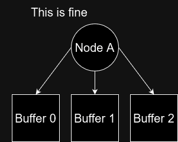
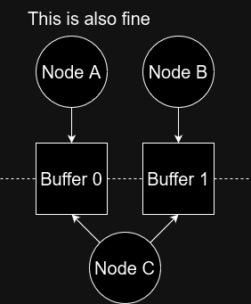
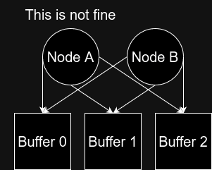

# 2️⃣ Building a Computational Graph
Ok, so now we have the basic building blocks ready. We also have a very simplifying set of constraints. This
allows us to just represent this graph as a straight line. Thus we can just represent our graph as a
series of nodes in a list. This list needs to be runnable both on the CPU and the GPU, so we'll look
at how we can make a CPU graph runner and a GPU graph runner which can interpret the same list of
commands and still work just fine. First we are going to do this on the CPU, then the GPU. Then
we are going to run the GPU graph in a loop instead of reconstructing it with every iteration.
This also the part where we really start to let loose, creating graphs of different sizes,
creating arbitrary permutations of linear and ReLU nodes and seeing what the benchmarks can show us.

## Building the CPU Graph
The CPU version of the computational graph is found in ```src::graph::nodes.rs```,
```src::graph::graph_runner.rs```, ```src::graph::graph_validation.rs``` and
```src::shared::graph_operators.rs```. First of all, a graph is given as a
```Vec<GraphOperator>``` whether it is headed for the CPU or the GPU.
It can be found in ```src::shared::graph_operators.rs```.
```GraphOperator``` is an enum and has all of the operators we are used to,
```Linear```, ```ReLU```, ```Softmax```, ```LinearReLUFused``` and ```LinearReLUSoftmaxFused```.
Additionally, it has ```HostToDevice``` and ```DeviceToHost```. But hold up, you might think,
the CPU part of the code shouldn't do any transfers to device (GPU) or back, well, I'll get to
that in a second. In benchmarking we will define this ```Vec<GraphOperator>``` the same for
both CPU and GPU. For this to work, the list has to live up to the highest minimum requirements,
which is the GPU in this case. Each graph runner (that's just a term I came up with, I don't know
what the standard term is) has to interpret that list and translate it to its own set of instructions.

In general, it is a way to sequester state by changing the type from layer to layer in your pipeline.
Imagine a physics engine. Sure, could just represent everything as a float of a high enough precision and
"just name our variables correctly", which is once again a red flag as our systems should never rely on
the absence of human errors, or we could create new types which makes sure that we don't mix up
Newtons per second and meters per second. We can even ensure that only certain operations are available
for a ```NewtonsPerSecond``` type. One of those operations could be a
```GarbblediGook(&self, meters_per,_second: &MetersPerSecond) -> NewtonMetersPerSecondPerSecond```
function (sorry, I'm not a physicist), which would nudge us towards correct type usage. Getting back to
our graph system, in much the same way, our ```GraphRunner``` found in ```src::graph::graph_runner.rs``` can take in a ```Vec<GraphOperator>``` and output a verified ```Vec<Node>``` which contains not only
verified data and dimensions, but additional information. So what happens for the ```HostToDevice``` and
```DeviceToHost``` on the CPU is basically just dimension verification. Just keeping track of which buffer
goes where. You can almost think of it as a passthrough operation. It is used when verifying the
dimensions and when creating the buffers needed to run the graph, but at run time, encountering an
```Input``` or ```Output``` operator does nothing.

```rust
#[derive(Clone, Debug, Eq, Hash, PartialEq)]
pub enum NodeOperator {
    Input,
    Output,
    Transfer,
    LinearLayer,
    ReLU,
    Softmax,
    LinearReLU,
    LinearReLUSoftmax,
}

#[derive(Debug)]
pub struct Node {
    pub name: String,
    pub operator: NodeOperator,
    pub buffer_indices: Vec<usize>,
}
```

In this case I decided, when first verifying and then processing the input vector to generate the
requisite buffers, put them in a vector of buffers and for each ```Node``` to just carry around the
indices of the buffers in our buffer list. This puts some restrictions on how dynamically we can treat
our list of buffers. We can't just remove a buffer and move all of the succeeding buffers one slot to the
left. ```buffer_indices``` is ```Vec<usize>``` because each ```NodeOperator``` type, has a different
amount of buffers it needs to reference. Using indices like this also means we don't need any
smart pointers and the transfer of data from one operator to the next is handled by having indices to
the same buffer, as well as our graph being executed sequentially, so we don't need to worry about
only one access happening to a buffer at a time as only one operator will be running at a time.

Ok, so now we've rummaged around a little bit, try to go back to the files relevant to the CPU graph
and see what they're doing. Don't worry about understanding the ```sorted_mutable_references```
function.

## Building the GPU Graph
Ok, so now let's take a look at how the GPU graph does almost the same. Verification, translation
and allocation. Start by perusing the relevant files - ```src::graph::nodes_gpu.rs``` and
```graph_runner_gpu.rs```. The validation is the exact same.

Once again, the GPU graph runner, takes a vector of nodes, it validates the correctness, it translates
the nodes to its own intermediate representation (see below), and allocates any and all buffers. It uses the indices to share data between operators.

```rust
#[derive(Clone, Debug, Eq, Hash, PartialEq)]
pub enum NodeOperatorGPU {
    HostToDevice,
    DeviceToHost,
    DeviceToDevice,
    LinearLayer,
    ReLU,
    Softmax,
    LinearReLU,
    LinearReLUSoftmax,
}

#[derive(Debug)]
pub struct NodeGPU {
    pub name: String,
    pub operator: NodeOperatorGPU,
    pub buffer_indices: Vec<usize>,
}
```

Note the ```DeviceToDevice``` operator is in there now. It is just a transfer of data from one
operator to the next. It actually does nothing in itself, but it is used by operators to get the previous
operators output and it outputs a ```DeviceToDevice``` itself to send its output to the next operator.
This simplifies our handling of the inputs and outputs and makes the communication between
operators explicit instead of depending on implicit communication. This isn't actually that much
of an issue with this setup as we know there is only ever one preceding operator and none of the
operators writes to more than a single buffer, but the second either of those cases were needed
we would have to rewrite it or accept that we had to handle a lot of cases. The ```DeviceToDevice```
operator doesn't cost anything when running the graph and you can verify that the runner
does nothing when it sees a ```DeviceToDevice``` operator.

Finally, you can see that for every operator, the necessary bindings are made and commands are generated
and enqueued in a command buffer. Once all operators have been added to the queue note that there is
not a synchronization, but the commands are submitted to the queue. The synchronization does not happen
until the result are retrieved.

In the next section, s5, we will look at how a system could take the computational graph and aside from
verifying and translating, actually optimize, given the knowledge of the graph. I will also run
a benchmark so you can see the differences in our assortment of implementations.

_________________

## 3️⃣ Borrow Checking a Graph?
Ok, so what if we actually wanted a more complex, and applicaple in real-world circumstances, graph
we ironically need to deal with the issues that Rust enforces through the borrow checker.
If we have one node writing to multiple other nodes, that is fine.

<figure markdown>
{ width="400" }
<figcaption>
One node writing to multiple buffers is fine.
</figcaption>
</figure>

<figure markdown>
{ width="400" }
<figcaption>
One node reading from multiple buffers is fine. The dashed line is a synchronization barrier. 
Nodes A and B can write to buffers, node C just has to be sure that nodes A and B are done before reading.
</figcaption>
</figure>

<figure markdown>
{ width="400" }
<figcaption>
Multiple nodes writing to the same buffer is not fine.
</figcaption>
</figure>

Multiple nodes writing to the same buffer is not correct, unless they either write only to
specific sections, such as if concatenation takes place and node A might exclusively write
to indices 0-16, with node B exclusively writing to indices 17-32. Either that or we
have to use synchronization through mechanisms like atomics (more about that in m2)
to ensure that the calculations are correct. This is essentially what the borrow
checker enforces in Rust. You either hand off one part of memory to one writer
and another part of memory to another writer (slice references) for exclusive access
or you use the more expensive synchronization primitives to make the reads and writes
to those elements sequential.

Unfortunately, ```wgpu``` and ```wgsl``` don't have a borrow checker, and we have to do that
analysis ourselves. Sometimes it can make sense to actually do this contentious writing
to a shared buffer amyway, as the synchronized version can be substantially more expensive
and correctness might not be worth the cost. But if you feel you need to introduce this
sort of incorrectness to your system, my recommendation is that you make absolutely sure that
the incorrectness is confined to as small a pocket of your system as possible.
