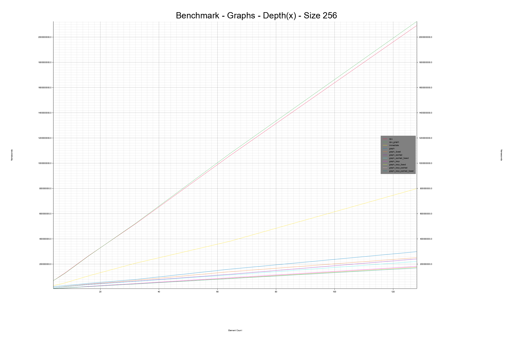

# 2️⃣ Building a Computational Graph Compiler
Ok, so we are almost done with this module. Let's put it all together and execute the graphs,
except I have three more variations to explain before I present the benchmark graph.

Compiling the shaders for each operator is actually quite expensive, so I put a flag on the GPU graph
runner which if ```true``` will cache all of the compiled shaders for reuse later.

Next up, we have the fused variant. This is our own little mini-compiler. This one is for both the CPU
and the GPU graph runners. If ```true``` the graph runners will replace any instance of
```Linear/ReLU/Softmax``` or ```Linear/ReLU``` with a fused version. But as softmax can only ever
be the final operation and a ReLU the one before the softmax, and thus there will always be at
most a single instance of a fused ```Linear/ReLU/Softmax``` operator, we will mostly see the
effect of ```Linear/ReLU``` fused operators. Remember, that for a network of depth N we have
N - 2 operators that are randomly either a linear or ReLU operator.

Finally, there is the graph loop variant. This variant is not just creating a computational graph, but
moves the loop from the measuring function closer into the graph runner itself. One thing to note though
is that while we do cut down on some transfers, the implementation is still suboptimal. I will elaborate
about why in 3️⃣. So just take this as an indicator of why you should use computational graphs
and computational graph compilers when you can.

<figure markdown>
{ width="600" }
<figcaption>
Benchmarking randomly generated graphs of depth 64 at various tensor sizes across 10 samples.
This benchmark was run on my laptop boasting an Intel i7-1185G7, 3.0 GHz with 32GB of RAM. The operating system was
Windows 10. The L1/L2/L3 caches were 320 KB, 5 MB and 12 MB respectively.
</figcaption>
</figure>

<figure markdown>
{ width="600" }
<figcaption>
Benchmarking randomly generated graphs of various depths and a size of 256 across 10 samples.
This benchmark was run on my laptop boasting an Intel i7-1185G7, 3.0 GHz with 32GB of RAM. The operating system was
Windows 10. The L1/L2/L3 caches were 320 KB, 5 MB and 12 MB respectively.
</figcaption>
</figure>

As we can see from the benchmarks, if you have small enough matrices, it can at some point be more efficient to just
use the CPU. But the graph running in a loop seems to work to be better over all. If you were a machine learning
researcher, these graphs are sort of an overview of why you should use a system that formulates a computational
graph, and why you should use optimization on that graph if it is available. The difference in performance you pay
for. Either with your time or your budget. So if you use something like PyTorch, do be sure to optimize, and be
sure to check whether the ```torch.compile()``` function works for your setup. Next up is the parallelism module
where you will be introduced, very superficially, to a couple of different concepts in parallelism. Hopefully,
this will help you to understand stuff like model distributed parallelism and data distributed parallelism.

_________________

## 3️⃣ Seeing the Memory Hierarchy
Ok, so what we just did, with the graphs and the operator fusions and the what not, what did it do in terms
of the memory hierarchy? For the CPU, it didn't do a whole lot other than adding another layer of complexity,
but let's focus on the GPU. When we went from the immediate mode, to the graph version, it saved us from
transferring to and from the GPU for every operation. It also meant that instead of adding each operation to the
queue and then waiting for it to complete, we could just add all of the operations of our graph and then wait.
So far so good. But what did the fused versions do?

When calculating the linear operation, it kept the output in the threads register and applied the ReLU function
once the data in register before storing it in the GPU's RAM and dispatching a new compute shader.
One of the suggested exercises is to optimize the linear shader. In any case that should involve tiling and
shared memory. That would mean that the matrix-matrix multiplication would need the work group to act in
coordination and load in tiles of the matrices into shared memory (L1 cache) and synchronize, in order for
them to get more out of memory they might otherwise have overlapping accesses of. Finally, when we use
the graph loop, we don't actually tell the GPU to run this same queue for N iterations, but add to the
queue, submit and wait N times. If we found the correct tools to tell the GPU to run some program for
100 times, it might completely set the GPU free for a while.

## 3️⃣ The Results and the Caveats
Ok, so we just saw some results previously. I am mostly concerned with showing you the relative timings, otherwise
I probably wouldn't be benchmarking on a laptop, but there a number of caveats that might make the benchmarks
look slightly different. Some of these I might fix if/when I get the time, some are left as potential exercises,
as again, this is more of an introduction to a bunch of concepts, and you get the point at this point hopefully.
Point.

Anyways, the ```Tensor2DGPU``` currently allocates a staging buffer, even for the ones that don't need it.
If this was made optional, immediate mode computation would do an allocation less, so would all of the other
GPU paradigms, but immediate mode is probably the one hurting the most here.

Another pain point is the use of the one shot receiver, instead of being a reusable receiver. I tried to change it
but I wasn't quite able to debug its behavior. If I get the time this is definitely something I would like to
change. This results in the ```graph_loop``` versions only actually transferring back to the CPU once. So, fixing
this is likely to make the ```graph_loop``` versions a bit slower. Not remaking the receiver each time and mapping
buffers, but keeping them around might make that part of the process a bit faster.

Finally, for the umpteenth time, the max, sum and linear shaders are completely unoptimized. The impact of max and
sum are neglible due to only being called once per graph, but optimizing the linear operator would probably see
all of the GPU based implementations run significantly faster.

## 3️⃣ Metaprogramming
Finally, I am going to introduce you to another way of representing these operators. Instead of having an
operator with a full implementation of each operator and a lot of hardwired rules like, if a
linear operator is followed by a ReLU operator, fuse them, you can attain a bit more flexibility by
realizing one thing...

Programs are just strings!

We can decimate all of our neatly written shaders into something called op codes. You start by defining
all of the data that goes in, you have a few lines of the thread figuring out its own ID and so on.
Peruse the directory ```src::op_code_compiler::runner.rs``` or
[online](https://github.com/absorensen/the-guide/blob/main/m1_memory_hierarchies/code/computational_graphs/src/op_code_compiler/runner.rs)
. This is just a toy example, it didn't make
sense to make the whole thing and I won't be benchmarking it since the results will be the exact same
as the operator version. Each op code is just a string. Each operator is just a list of op codes.
In this op code example we do operator fusion by adding our ReLU op-code to the list.

This is sort of like ordering a standard cheese burger at a restaurant that ONLY SERVES BURGERS.
You realize that you want pickles. So you can either order an entirely new cheese burger, the
kitchen has to make a new one from scratch for this one, or you can order pickles between
two buns, which technically qualifies as a burger. This will be delivered quite fast. But its
frowned upon in a restaurant to play with your food so you have to eat the pickles as they come.
But you do technically get your pickles. Another option is to realize that a burger is just a
stack of ingredients, or a list of op codes, and it would be much easier to send the burger
back to the kitchen (compilation) for them to just slide in a few pickles. Using op codes
makes our code so much more complex, but it allows us a great amount of flexibility. If we
found out we were running on a GPU with a much bigger L1 cache, we might change how we
handled shared memory programming. If we were doing a render graph with a number of image-based
single pixel operations such as tone mapping, changing hues or saturation, we might use op codes
to merge these several different calls, keeping the data as close to the registers as possible.

Another thing, often done in graphics is to have various defines in your shader code like

```rust
#ifdef USE_SHARED_MEMORY
// something with shared memory
#endif
```

Then if at runtime you find out it would be optimal to use shared memory you can merely append
a

```rust
#define USE_SHARED_MEMORY
```

at the top of the shader file and then compile. This makes your code less readable, but not as unreadable
as fully using op codes.

## 5️⃣ Additional Reading
[Fun and hackable tensors in Rust](https://getcode.substack.com/p/fun-and-hackable-tensors-in-rust)  
[Massively Parallel Fun with GPUs](https://getcode.substack.com/p/massively-parallel-fun-with-gpus)  
[Compute Shader Glossary](https://github.com/googlefonts/compute-shader-101/blob/main/docs/glossary.md)  
[Torch.fx](https://pytorch.org/docs/stable/fx.html)  
[torch.compile](https://pytorch.org/docs/stable/generated/torch.compile.html)  
[Getting started with PyTorch's Dynamo compiler](https://pytorch.org/docs/stable/dynamo/get-started.html)  
