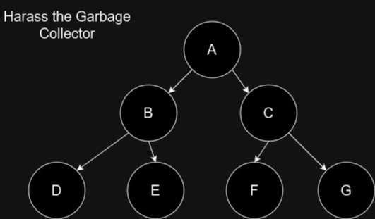

# 👨🏼‍💻 Exercises
## Pen & Paper Exercises
### Vector Memory
Write out the stack and heap memory of THIS sequence of vector operations.
You can represent unitialized memory with a *.  
The vector must double its size and copy over each element once it gets a push operation while at capacity.
The vector must resize to half its size and copy over each active element once it gets a pop operation while at
quarter capacity.

* Create new vector of capacity 4
* .push(5)
* .push(2)
* .push(1)
* .pop()
* .push(42)
* .push(350)
* .push(1337)
* .push(1)
* .push(2)
* .push(5)
* .push(10)
* .pop()
* .pop()
* .pop()
* .pop()
* .pop()
* .pop()
* .pop()
* .pop()

Barring a few errors here and there this should be a simple exercise. Except.
Are you sure you got all of the undefined (*) values right?

Which common operation could have replaced the last sequence of .pop() operations
in the case where you wouldn't be using the popped values?

### Linearized indexing  
You have an array of dimensions ```MN``` in a linearized array ```data```, write pseudo code that iterates
through all data elements using two for-loops and doubles the value in place.

You have an array of dimensions ```MNK``` in a linearized array ```data```, write pseudo code that iterates
through all data elements using three for-loops and triples the value in place.

### Naive data loading
Next up, we have a little scenario to play out. I stole the code below from a tutorial on image super resolution
networks. The tutorial is a great intro to the type of network and the process. It wasn't about optimization,
but I noticed a severe bottleneck in training and localized it to the data loader. Normally, I would of course
link to the tutorial, but in order to not shame the person who made the tutorial (who did a great job), I don't
think I will. If that person would like to be linked to anyways, I will be more than happy to do so.

You are training a neural network for upscaling images. The data
is a high resolution (original resolution image) and a low resolution (downsampled) image. The network
will train for N epochs. Each epoch will go through the entire data set once. To go through the N
epochs, M batches will consist of K randomly selected images from the entire data set.

The images will be retrieved for a batch, assuming K calls to ```__getitem__``` with random values of ```i```.

```python
def __getitem__(self, i):
    """
    This method is required to be defined for use in the PyTorch DataLoader.

    :param i: index to retrieve
    :return: the 'i'th pair LR and HR images to be fed into the model
    """
    # Read image
    img = Image.open(self.images[i], mode='r')
    img = img.convert('RGB')
    if img.width <= 96 or img.height <= 96:
        print(self.images[i], img.width, img.height)
    lr_img, hr_img = self.transform(img)

    return lr_img, hr_img
```

Draw the memory hierarchy of the CPU. Assume you are training on the CPU. What does the
data movement look like when training an epoch?

If we switch to training on the GPU, can you add the GPU's memory hierarchy? Now describe
the step-by-step movement of data in order to train an entire epoch?

What could you do to make this process more effective?

### Killing the garbage collector
<figure markdown>
{ width="500" }
<figcaption>
Where would you add a pointer to hurt garbage collection the most?
</figcaption>
</figure>

Which pointer kills the reference counting garbage collector?  
If the garbage collector implements cycle detection to depth 2 adding which pointer would break it?
The nodes can't point to themselves.  

<figure markdown>
{ width="500" }
<figcaption>
How could you make this sort of general graph, with very few restrictions, safe for garbage collection?
</figcaption>
</figure>

In the case of the multiply connected nodes, can you come up with a structural solution which allows
us to make arbitrary graphs in a garbage collected setting or safe in a C++/Rust setting?

## Programming
Extend the computational graph with an inplace operation for the ReLU operator (only for the non-fused ReLU)

The following list is sorted by expected complexity - do at least 1

* Add reusable buffers to the computational graph system (for the intermediate activations)
* Implement a shader cached version of the immediate mode GPU operators and add it to the benchmark
* Implement a version of the linear layer functions which uses shared memory and tiling
* Change the ```Tensor2DGPU``` to have switchable access details on its buffers. It should be able to
accomodate some tensors being exclusively read-only. Do you see any performance differences for whether
they are read-only or not?
* Implement the tree reduction version of the sum function and add it to the softmax function.
Also compare the single pass and the tree reduction performance graphs. [Reference](https://developer.download.nvidia.com/assets/cuda/files/reduction.pdf)
* Implement a max pooling operator, as well as fusing with ReLU, in all levels and implement tests
* Implement a convolution operator, as well as fusing with ReLU, in all levels and implement tests
