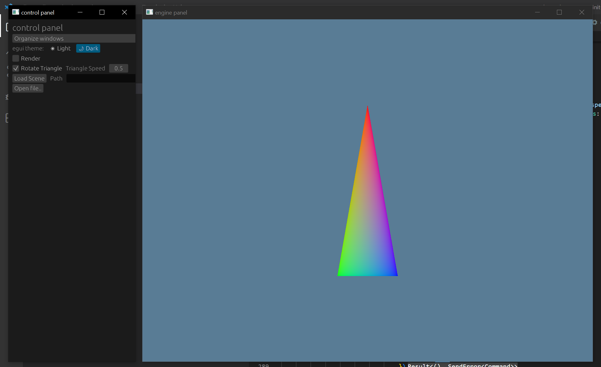

# wgpu-winit-egui-template
Looking for a template for learning wgpu with a GUI? This one is for you!

The setup is made to disentangle egui and your own wgpu-based render engine in order to just learn wgpu. The main thread sets up everything and runs the event loop. It also handles rendering the GUI. The GUI is only rendered if an element is in focus or an event is triggered by the user moving the mouse over the control panel window. The application and the GUI layer both send commands via crossbeam_channel::Sender. The crossbeam_channel::Receiver is owned by the render engine thread and it empties the receiver once every loop, but does not block on it. The render engine is its own thread to allow you to make your own engine as its own thing. The default shader running is a triangle with interpolated colors. If the button in the GUI for rotating triangle is on, the triangle will rotate. The render engine is is not very organized, and is meant to be a placeholder for you to put in your own engine.

I hope you enjoy!
