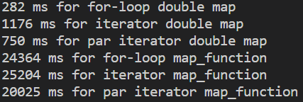
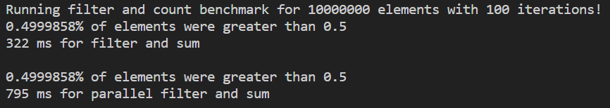
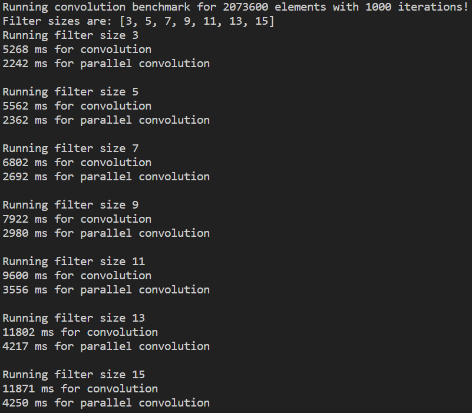

# 2️⃣ Data Parallelism
The next sections will be heavily inspired by the book "Programming Rust"'s multiple implementations of
[Mandelbrot](https://github.com/ProgrammingRust/mandelbrot/) image generation.
If you don't know about the Mandelbrot image, you can see what that's all about
[here](https://www.co-pylit.org/courses/cosc1337/lectures/17-Complex-Numbers/02-mandelbrot-math.html)!
Ok, so I will start off talking about the parallel part of things. First off, lets look at 
[Rayon](https://github.com/rayon-rs/rayon), which is the easiest way of doing parallelism in Rust.

To use Rayon, we just have to formulate our computations as iterators. Under the hood Rayon divvies up the work
into chunks and distributes it to a fitting amount of threads. It also does something called work stealing where if
one thread is done with its work sooner it gets work from one of the other threads. This is really good
for very uneven workloads like generating Mandelbrot images or path tracing. Again, this is the easiest
way of doing parallelism in Rust, both because it is such a small change from idiomatic Rust (using iterators)
and the cognitive load, if there is no communication between threads, is so very small.

## A Parallel Iterator Benchmark
You can find the code for this section in ```src/m2_concurrency/code/data_parallelism``` or
[online](https://github.com/absorensen/the-guide/tree/main/m2_concurrency/code/data_parallelism).

First we define our data, how many elements we want, and how many iterations we will iterate through
the data to do our benchmarks.

```rust
    let element_count: usize = 10_000_000;
    let iteration_count: usize = 100;

    let mut data: Vec<f32> = (0..element_count).into_iter().map(|x| x as f32).collect();
```

Now let's see what a non-iterator mapping of all the elements would look like.

```rust
    for _ in 0..iteration_count {
        for element in &mut data {
            *element = *element * 3.14;
        }
    }
```

A key difference with this approach compared to the other two is that we are ensured this mapping happens in-place.
The iterator version is here -

```rust
    for _ in 0..iteration_count {
        data = data.iter().map(|x| *x * 3.14).collect();
    }
```

Once we have done this reformulation, Rayon is made to be a drop in replacement. We just
import the needed Rayon prelude and replace ```.iter()``` with ```.par_iter()``` or
```.into_iter()``` with ```.into_par_iter()```.

```rust
    for _ in 0..iteration_count {
        data = data.par_iter().map(|x| *x * 3.14).collect();
    }
```

Finally, for reasons I will explain in a little bit, there is a variant of all three where they instead of a
multiplication call this function -

```rust
#[inline(always)]
fn map_function(x: f32) -> f32 {
    let mut x: f32 = x * x * x * x + x * x + x * x / x + x;

    for _ in 0..62 {
        x = x * 2.0 + 4.0 + 12.0 / 59.0;
    }

    x
}
```

Now let's run the benchmark.

<figure markdown>
{ width="400" }
<figcaption>
First a simple mapping operation, and then a slightly more complex map function.
This benchmark was run on my laptop boasting an Intel i7-1185G7, 3.0 GHz with 32GB of RAM. The operating system was
Windows 10. The L1/L2/L3 caches were 320 KB, 5 MB and 12 MB respectively.
</figcaption>
</figure>

Ok, so what actually happened here? For the first three lines, we have an extremely small workload per element.
We are very likely just limited by memory bandwidth. The simplest implementation seems to win out. Rayon needs to
make sure it has the amount of threads ready and to distribute the work. Think of it like adding a for-loop. It's
extra administration. Much like real life, simple processes rarely need complex administration. But once
we add a more complex workload the simple for-loop and the iterator seem to converge to the same performance,
whereas the ```.par_iter()``` from Rayon begins to win out. If we gave each element an even heavier workload,
it is likely that the performance gain from Rayon would increase. Personally, I have used Rayon to parallelize
a path tracer, starting with a range of all the pixels and then having Rayon distribute the workload of
path tracing every pixel. In that case we have a VERY complex workload and I saw an almost linear scaling
compared to the amount of threads available. I wouldn't recommend it, but if you want to see a larger system
you can check it out [here](https://github.com/absorensen/raytracing_in_rust). The parallelization can be found
in ```render_pixel()```
[here](https://github.com/absorensen/raytracing_in_rust/blob/main/src/render/integrator.rs)
and the ```render()``` [here](https://github.com/absorensen/raytracing_in_rust/blob/main/src/lib.rs).

So, now that we can conclude that Rayon can be really good and easy to use for some things, let's move on
to more explicitly define our own parallel system with, perhaps, longer running threads.

## 3️⃣ Examples with Rayon
You can find the code for this section in ```src/m2_concurrency/code/data_parallelism``` or
[online](https://github.com/absorensen/the-guide/tree/main/m2_concurrency/code/data_parallelism).

Ok, so I made two additional examples. There's lots of different adaptors for iterators and I'll just show two.
```.filter()``` and ```.window()```. If you go back to the file from earlier and change the bool in the
main function to ```true```, it should now run these two 3️⃣ benchmarks. First off let's look at the filter
benchmark. Filter is like map, except it will only emit elements which result in a ```true``` evaluation inside the
closure. First we generate a vector of random floats with values between 0.0 and 0.1. Then we filter on them
using the following lines -

```rust
    sums += data.iter().filter(|x| if 0.5 < **x { true } else { false }).count();
```

If the random number generator used to generate the floats in ```data``` is completely uniform, every time we use
this filter, the filter should emit half the elements. Then we just count the amount of elements emitted.
The parallel version is very similar -

```rust
    sums += data.par_iter().filter(|x| if 0.5 < **x { true } else { false }).count();
```

If we run this benchmark we get the following -

<figure markdown>
{ width="600" }
<figcaption>
Counting all floats greater than 0.5.
This benchmark was run on my laptop boasting an Intel i7-1185G7, 3.0 GHz with 32GB of RAM. The operating system was
Windows 10. The L1/L2/L3 caches were 320 KB, 5 MB and 12 MB respectively.
</figcaption>
</figure>

As you can see, once again, with a limited amount of work, parallelism isn't necessarily the answer to everything.

Next up, I will run a small program to perform convolution. We generate a data vector of random floats. Then we have
a number of filters of different sizes, to show the effect of a greater sized filter. To convolve, with a filter
of size N, for this example let's say N = 3, for the first output element, we take data element 0, multiply it
by filter element 0 and add it to a sum. Then data element 1 times filter element 1, add it to the sum. Data
element 2 multiplied by filter element 2. Add it to the sum and then emit/store the output element. In Rust,
it can look like this -

```rust
    //
    // Convolution
    //
    let element_count: usize = 1920*1080;
    let iteration_count: usize = 1000;
    let filter_sizes: Vec<usize> = vec![3, 5, 7, 9, 11, 13, 15];

    println!("Running convolution benchmark for {} elements with {} iterations!", element_count, iteration_count);
    println!("Filter sizes are: {:?}", filter_sizes);
    let mut rng: ThreadRng = rand::thread_rng();
    let data: Vec<f32> = (0..element_count).map(|_| rng.gen_range(0.0..1.0)).collect();
    let mut filters: Vec<Vec<f32>> = Vec::<Vec<f32>>::new();
    for size in &filter_sizes {
        let filter: Vec<f32> = (0..*size).map(|_| rng.gen_range(-1.0..1.0)).collect();
        filters.push(filter);
    }
    // Remove mutability to be sure.
    let filters: Vec<Vec<f32>> = filters;
```

Note that you are completely free to just change around the first three values. You can also try
running different filter sizes. Now that we have created our 7 filters we will apply them -

```rust
    for _ in 0..iteration_count {
        let filtered: Vec<f32> = data.windows(*size).map(|x| {
            x.iter().zip(filter).map(|(element, filter)| *element * *filter).sum()
        } ).collect();
        filtered.iter().sum::<f32>();
    }
```

or in the parallel version -

```rust
    for _ in 0..iteration_count {
        let filtered: Vec<f32> = data.par_windows(*size).map(|x| {
            x.iter().zip(filter).map(|(element, filter)| *element * *filter).sum()
        } ).collect();
        filtered.iter().sum::<f32>();
    }
```

Note that instead of the ```.iter()``` adaptor that we would normally use to get an iterator to a single
element at a time, we now use ```.windows()```, which takes an argument. This argument is the size of the window.
If we for example give it the size 3 it will return elements 0, 1 and 2 for the first iteration, then
elements 1, 2 and 3 for the second iteration. This isn't available in a ```.windows_mut()``` like ```.iter_mut()```.
Why do you think that is?

<figure markdown>
{ width="600" }
<figcaption>
Random convolution on random data.
This benchmark was run on my laptop boasting an Intel i7-1185G7, 3.0 GHz with 32GB of RAM. The operating system was
Windows 10. The L1/L2/L3 caches were 320 KB, 5 MB and 12 MB respectively.
</figcaption>
</figure>

In this case, with the greater computational complexity, Rayon easily takes the lead.
