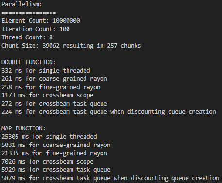

# 2️⃣ Locks
We just took a look at how to launch and distribute some work to multiple threads.
But we did some extra work to separate the data into neat chunks, with no overlap
between which thread read and wrote to which data. So, how would we ensure
correctness and performance (in that order!) if we had data which more than
a single thread had access to?

As we saw earlier we can easily share read-only data between threads with the
atomically reference counted construct in Rust, ```Arc<T>```. But ```Arc```
cannot handle if even just one of the threads accessing some shared data
needs write access. What we can do is to wrap our data in a lock. Locks can
be used for all sorts of things, but this is just one example.

[Locks](https://en.wikipedia.org/wiki/Lock_(computer_science)) come in different shapes and sizes,
an often seen variant is the Mutex, short for mutual exclusion. A lock is used to ensure that only
one thread can access a given region of code or data at a time. One potential implementation of this
could be a lock using a binary
[semaphore](https://en.wikipedia.org/wiki/Semaphore_(programming)) protecting a piece of data.
Any thread that wants to modify or read that piece of data will need to try to acquire the lock.
If it is a spin lock, the thread will actively wait until it can acquire the lock. Once a thread
has acquired a lock it is free to act inside the critical region guarded by the lock. Once it
is finished it should release the lock. If this fails to happen, the threads who are waiting
to acquire said lock will continue to wait indefinitely. If the thread currently holding the lock
is stuck waiting to acquire a different lock, which it also won't ever acquire, one or more threads
will be in a deadlock.

Any time we use a lock around a small piece of data or any kind of region, we incur a cost. Both in
terms of allocating more memory, but also in terms of all of the time spent waiting to acquire and
release locks. A lock is effectively a serialization of a region of code. Think back to Amdahl's
law. The more threads are vying for a lock the more lock contention in your code. This is of course
at odds with the lock overhead. The more locks, the more overhead, but the lower the contention.
Dependencies between locks, like a thread needing to hold more than a single lock at a time,
increases the chance of incurring a deadlock.

I won't go much deeper about locks, you are definitiely welcome to read some of the links, but
the basic conclusion is, you should understand what they do, you should be able to use elements from
libraries that use them, but if you find yourself thinking you should use a lock for something...
reconsider. Be absolutely sure that that is what you need, and if you do, you need to spend some more time
thinking about how to implement it and you need to minimize your exposure by minimizing the regions where locks
are used.

## Locks in Rust
Rust does have various locks as part of the standard library and I'll very briefly go through a few examples.
But again, if you can not use locks, try not to use locks. I tried to come up with my own explanation for
locks in Rust, but this page from [The Book](https://doc.rust-lang.org/book/ch16-03-shared-state.html)
is quite good.

## 3️⃣ Work Queue
So let's try to go back to how we could improve the performance of crossbeam when splitting our data
into chunks and having threads work on a chunk each. This time we will use a mutex to create
a [task queue](https://github.com/ProgrammingRust/mandelbrot/blob/task-queue/src/main.rs).

You can find the code in ```m2_concurrency::code::locks``` or
[online](https://github.com/absorensen/the-guide/tree/main/m2_concurrency/code/locks).

As you can see, the two added functions have gotten *slightly* more complex -

```rust
{
    let mut total_time: u128 = 0;
    let now: Instant = Instant::now();
    for _ in 0..iteration_count {
        let task_queue = Arc::new(Mutex::new(zipped_chunks.iter_mut()));
        let iteration_now: Instant = Instant::now();
        crossbeam::scope(|spawner| {
            for _ in 0..thread_count {
                let task_queue_handle = Arc::clone(&task_queue);
                spawner.spawn(move |_| {
                    loop {
                        match {
                            let mut data: std::sync::MutexGuard<'_, std::slice::IterMut<'_, (&[f32], &mut [f32])>> = task_queue_handle.lock().unwrap();
                            data.next()
                        }
                        {
                            None => { return; }
                            Some((input_chunk, output_chunk)) => {
                                map_function(input_chunk, output_chunk);
                            }
                        }
                    }
                });
            }
        }).unwrap();
        total_time += iteration_now.elapsed().as_millis();
    }
    let elapsed_time: Duration = now.elapsed();
    println!("{} ms for crossbeam task queue map function", elapsed_time.as_millis() as f64);
    println!("{} ms for crossbeam task queue map function when discounting queue creation", total_time as f64);
    println!("");
}
```

This time around we are making a task queue, a task queue which will be emptied with every iteration.
The task queue, is an Arc (to share this betweem threads) wrapped around a mutex (to allow us write access)
wrapped around a mutable iterator to allow us to go through the list of tasks. We are using
iterations to better benchmark the function. To accomodate this I recreate ```task_queue``` every iteration. To
showcase the effect of this I also added a timing specifically without the extra cost of the recreating the
queue every iteration, which the other solutions aren't burdened with. Next up, we create a scope, which
you should be familiar with by now. Inside the scope we give each launched thread a reference to the
queue. Once the thread has spawned, each thread will continuously try to get another piece of data to
work on, by acquiring the lock. Note that once the thread has acquired the lock and returned the next element
from the iterator, the lock is released by the scope ending.
If the iterator is empty the thread will jump out of the loop.
Note that I added another parameter to launch the benchmark, thus decoupling chunk size from thread count.

Now let's look at a benchmark.

<figure markdown>
{ width="800" }
<figcaption>
Crossbeam with a mutex around a task queue. Element count was 10.000.000, iteration count was 10, thread count was 8
and chunk size was element count / (thread count * 32).
This benchmark was run on my laptop boasting an Intel i7-1185G7, 3.0 GHz with 32GB of RAM. The operating system was
Windows 10. The L1/L2/L3 caches were 320 KB, 5 MB and 12 MB respectively.
</figcaption>
</figure>

As you can see there is a cost to recreating the task queue every iteration (the difference between the last two lines)
and we now approach the non-fine grained Rayon performance. Try to play around with the four values in the main
function to better understand when which solution is best.
