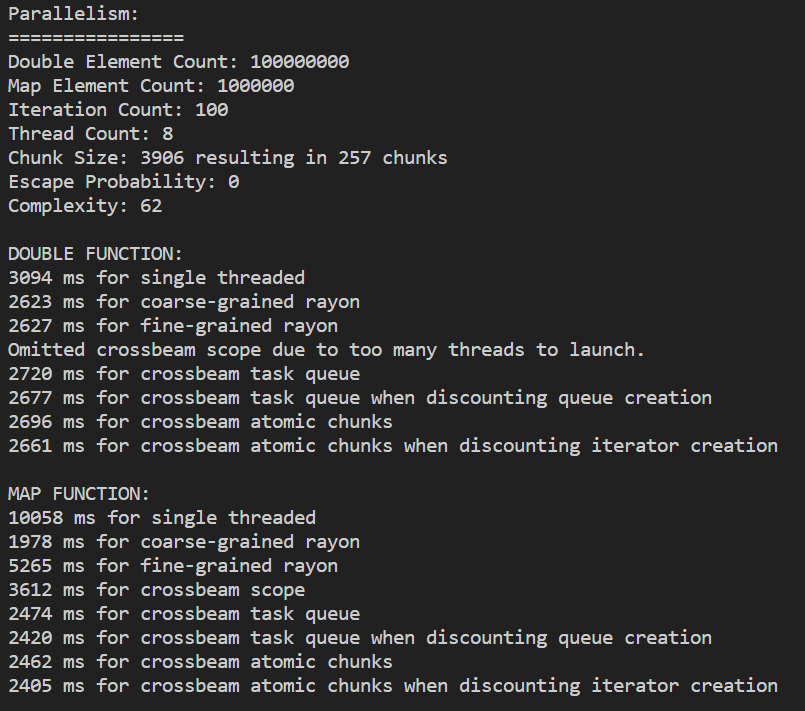

# 2️⃣ Atomics
If a mutex is a horse, an atomic is a pony. It is a lot smaller. This is usually a good thing!
The smaller a region serialized through synchronization, the more potential concurrency we can have
and the less likely things will go wrong. So what is an atomic?

Atomic operations are a special kind of very small lock. Atomics are specific to certain data types
and certain operations because there is sometimes hardware support for them. Now, whenever you see
the term "hardware support" you should think "SPEED". This means that you can work quite fast using
atomics, not as fast as not having any synchronization, but relative to the more cumbersome
mutex, it is quite fast. You can even use atomics in GPU programming. One tricky thing can be if
your language supports atomics, but your hardware doesn't. In that case the atomic operation will
be emulated in software which will make your code inexplicably slower.

First off, let's look at the concept of memory ordering. Afterwards I'll describe a few different
atomic functions you can use, and then finally look at what atomics are like in WGSL.

Anyways, memory ordering.

Various hardware platforms have different types of support for atomics. If we for
example had a counter variable, it could for example be used to sum an array, we could make sure that
the sum was correct while still being manipulated and accessed in a multithreaded setting by placing
the counter inside an atomic. The nature of how the counter is incremented is then dictated by the
memory ordering.

The function that we use for incrementing this summation counter can be called with
different orderings. We'll look at three different types, sequentially consistent, acquire-release
and relaxed. With sequentially consistent ordering, we can have certain guarantees in terms of which
thread is getting to read and write to the atomic variable in which order. This is likely to be
the most expensive ordering, but also likely to be the most consistent.

Acquire-release is a paired ordering. It is especially good for implementing locks with atomics.
If you used a bool or an integer (you could store which number thread currently holds the lock),
inside an atomic you could implement a lock for a critical section which could be acquired
and released. Having this implemented with atomics should ensure that there can only ever
be one thread holding the lock.

Relaxed ordering is the cheapest and has no guarantees about ordering. It is especially good for
the case of summation. We don't care about which order was used to sum an array of numbers, just
get it done. It is the easiest to comprehend, and to begin with I would recommend that you only
use atomics in a situation where a relaxed ordering is good enough. Otherwise we get into mutex
levels of complexity and you're gonna have a bad time.

In terms of types you will be limited to integers and bools. Which types are available in Rust
can be found [here](https://doc.rust-lang.org/std/sync/atomic/). Go to
[the page](https://doc.rust-lang.org/std/sync/atomic/struct.AtomicU32.html)
for ```AtomicU32``` and see which functions are available. There's some load, store and swap
operations, followed by some compare/exchange operations and then a bunch of fetch and something
operations. Try and read through them. In practice you would share the atomic variable between threads
by wrapping it with an ```Arc<Atomic...>``` and cloning the ```Arc```.

WGSL, the language used to make GPU programs in this guide, only supports ```atomic<T>``` where ```T```
is either ```i32``` or ```u32```. All atomic functions have ```relaxed``` memory ordering. It's really
good for things like reduction operations. Once each work group has a local result computed, they can
compare results, or add, across work groups through a global atomic variable. You can check out which
functions are available, which is a bit more limited compared to what was available in Rust,
[here](https://www.w3.org/TR/WGSL/#atomic-builtin-functions).

## 3️⃣ Lock Free Algorithms
Lock free algorithms are a type of algorithms where there is a minimal amount of synchronization. Think of it as
atomic, yes!, mutex/lock, no!, atomic lock, no! This requires a fair amount of thought, but a very simple version
could for example to implement a queue of chunks this way. If we have an iterator or an index pointing to an array
of data chunks, we can use an atomic operation to increment the index or the iterator and get the former piece of
data. This is lock-free. There might some waiting time if 8 threads are all trying to get more data to crunch at
the same time, but no locks have to be acquired. But this way of using atomics to acquire a new piece of data
from an array is made possible with all these functions which don't just swap, compare or fetch, but also
do one more thing. We can increment and fetch to get our new data chunk!

## 3️⃣ Crossbeam and Atomics
Back to the storyline! Once again, go back to ```m2_concurrency::code::parallelism``` or
[online](https://github.com/absorensen/the-guide/tree/main/m2_concurrency/code/parallelism).
Set the ```crossbeam_atomic_chunks``` flag to true.

So, I pulled in the ```atomic_chunks_mut``` crate from the mandelbrot example you will see later.
It is a chunks iterator which uses atomics to increment an index. This allows each thread, whenever
asking for a new chunk to increment the current index and get the last index value. This is now
that threads data chunk. Thus we do almost the same as the one with mutex, but with an atomic
and an index.

<figure markdown>
{ width="800" }
<figcaption>
Crossbeam with an atomic chunk queue.
This benchmark was run on my laptop boasting an Intel i7-1185G7, 3.0 GHz with 32GB of RAM. The operating system was
Windows 10. The L1/L2/L3 caches were 320 KB, 5 MB and 12 MB respectively.
</figcaption>
</figure>

As you can see, the ```crossbeam scope``` section still performs terribly since we are launching 257 threads with
a chunk of data each. And while we can get good performance from the atomic chunks, the lower synchronization cost
doesn't make much of a difference with the bigger chunk size. For my money, I would say that the best return on
investment for your time, is probably experimenting with running either a fine-grained or a coarse-grained
Rayon accelerated iterator. The performance is closer to self-tuning and you have less of a headache worrying
about synchronization and ownership. You should of course always benchmark and use your own reasoning as to when
you need to optimize this.

Regardless, you should still try to benchmark different scenarios by changing the
values in ```main()```. Try to reason about the performance differences!

## 5️⃣ Further Reading
If you would like to learn more about atomics I can recommend you read about atomics and reordering in the
[Rustonomicon](https://doc.rust-lang.org/nomicon/atomics.html) or in the
the atomics chapter in Jon Gjengset's book [Rust for Rustaceans](https://nostarch.com/rust-rustaceans)
which is even better.

To read more about lock-free algorithms, go [here](https://en.wikipedia.org/wiki/Non-blocking_algorithm),
and [here](https://www.cs.cmu.edu/~410-s05/lectures/L31_LockFree.pdf).
