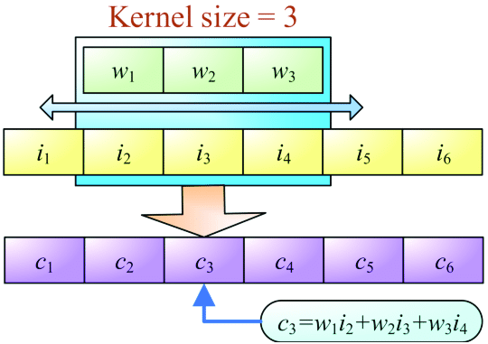

# 3️⃣ More GPU
This section is about giving a bit of additional context around GPUs.

## The Graphics Pipeline
Originally, GPU's were made just for graphics. They were intiially quite closed in their
form, with a lot of the internal pipeline hidden away from the user.
The classic vertex and fragment shader setup can be seen below.

<figure markdown>
{ width="700" }
<figcaption>
A simplified view of the traditional vertex/fragment shader setup. The geometry shader
is optional and not that popular anymore.
<a href="https://learnopengl.com/Getting-started/Hello-Triangle">
Image credit </a>
</figcaption>
</figure>

The geometry shader is a later addition and has largely fallen out of favor due to
dynamically generating more data in a way that yielded quite poor performance. But.
If you look at the figure you can see that vertex data is passed in. This is
transferred from the GPU. This will be all of the corners of the triangles
that make up a mesh. Aside from the purely positional data, it can also have
attributes like the normal vector, the texture coordinates or the color. The vertices
are passed in and the vertex shader has access to one vertex at a time. Each
vertex is transformed from the objects own space into the world, view and projection
spaces. The vertices are sent along. A geometry shader could create additional vertices
and resulting triangles, with a view of more than one vertex. This is optional.
In shape assembly, vertices are assembled to full triangles, afterwhich the triangle
is rasterized into fragments. Think of these fragments as potential pixel candidates.
Each of them have values which are barycentric interpolations of the three vertices
they are constructed from. Each fragment is then sent to the fragment shader,
which can see a single fragment at a time. Lighting can then be calculated per fragment.
Importantly, it is also possible for the fragment to know where its potential position
is in the coordinate space of the rectangle to which it will be rendered. Once
lighting and other fragment related information has been calculated the fragment can
be sent further along where it will be tested whether the fragment is the fragment
closest to the viewpoint of the camera, or whether it might be behind another fragment
and can safely be discarded. The fragment shader could also write or read from textures
or buffers. Other shaders can do that too, but I'm building to something.

Additional shader types include mesh, task, raytracing and tesselation. Possibly more.
Additional behind the scenes processes are performed to transform the data, doing
things like clipping to determine whether a fragment is even in view. If it is not
it can safely be discarded. This is not programmable.

Why do you think it was important that the fragment in the fragment shader had access
to its coordinate on the output surface? Take a second to think about it.

The fragment shader is the precursor to the compute shader. Knowing where you are on
the 2D output surface is tantamount to finding your thread ID. Allowing the fragment
shader to write to buffers and not just send the fragment to be renddered allows
you to save the calculations. Once upon a time, scientists thought it would be kind
of nice if you could use the GPU, which is a massively parallel device for scientific
computing. So they used fragment shaders in the early 2000's to do stuff like
matrix-matrix multiplication and FFT's. There were a number of research projects
in how to do GPGPU, eventually culminating in the official release of CUDA in 2007.
Nowadays compute shaders are a standard part of graphics APIs and workloads, with
an increasing amount of rendering pipelines using one or more compute shaders in their
pipelines. These compute shaders can happen at any point. In fact, in launching
the new Nanite system for Unreal Engine 5, one of the tech leads on the project,
Brian Karis, [revealed](https://www.youtube.com/watch?v=eviSykqSUUw) that for
select triangles, they would prevent them from being hardware rasterized and
instead write their own software based rasterizer which could outperform hardware
rasterization for very small triangles.

For a more thorough explanation of the graphics pipeline you can read this page
from [Learn OpenGL](https://learnopengl.com/Getting-started/Hello-Triangle).

## SPIR-V & GLSL
WGSL is somewhat limited in what it can do. If you would like access to more features
or to have a greater codebase you can copy from directly, WGPU has
[increasing support](https://docs.rs/wgpu/latest/wgpu/enum.ShaderSource.html#) for
both the GPU intermediate representation SPIR-V and the shading language GLSL (which can be
compiled to SPIR-V), without necessitation additional build scaffolding.
It also looks like it will make use of [naga](https://github.com/gfx-rs/wgpu/tree/trunk/naga)
directly. If you are sure your system has support for it (think back to extensions),
a more mature shading language like GLSL, might let you make use of more features. I
haven't had time to check it out yet, but if it can used without additional build steps
and administration, this might be a nice way to get access to more features.

## Additional Levels in the Memory Hierarchy
Last time I introduced concepts in GPU memory to you, we had two options.
A thread could either write its data to global memory (VRAM) from which
other threads could read the data, or it could share data with other
threads in the same workgroup, by writing to the user programmable
shared memory, residing in the L1 cache. There are two other options.
I know the first one is available in CUDA, it might be in some shader
languages and OpenCL, but it's certainly not in WGSL. In CUDA it is known as
[warp shuffling](https://developer.nvidia.com/blog/using-cuda-warp-level-primitives/).
When sharing data through shared memory, the cost to access shared memory is 10 cycles,
or it was last time I checked. Warp shuffling, or work group shuffling, is sharing
directly between the registers of each thread in a work group. It was 1 cycle to
access last time I checked. This is immensely useful in reductions and prefix sums.
You would still need to write data to global memory in order to share data between
work groups. Unless you are using a GPU supporting
[distributed shared memory](https://developer.nvidia.com/blog/nvidia-hopper-architecture-in-depth/).
At the time of writing, the Nvidia H100 is the only card supporting it.
Distributed shared memory allows accessing memory residing in the shared memory of
other work groups, as if it was one big shared memory. Hopefully, this feature
will make its way into other cards soon.

## Were you Scattering or were you Gathering?
While a complete guide on GPGPU algorithm design might be... more thorough at least, one core design aspect
you should definitely know is scattering and gathering.

<figure markdown>
{ width="700" }
<figcaption>
Answer!
</figcaption>
</figure>

An example of how we use either to accomplish the same thing is a 1D convolution. As you might recall, we have three
elements in play. We have an input signal, an array of size N. We have a filter with weights, an array of size M.
M will usually be an odd number from 1 to 19.
Finally, we have an output, usually also size N. The input signal can also be padded with 0's in each end in order
to minimize branching. Or the output is N-M+1 smaller in order to have an output which doesn't have (M-1)/2 0's at
the ends.

Anyways, for weight in our kernel we sample a different element in our signal, multiply it with a weight in
our filter, accumulate the result, and output a new signal.

<figure markdown>
{ width="700" }
<figcaption>
A figure showing a signal being convolved with a filter.
<a href="https://www.researchgate.net/figure/Calculations-involved-in-a-1D-convolution-operation_fig3_324177888">
Image credit </a>
</figcaption>
</figure>

I hope that makes sense now. Because, scattering and gathering are two different ways of executing this fairly
simple process which has quite an impact on performance. If we were doing 1D convolution on a GPU, from which
point of view do we program the threads? If they are scattering, they take the point of view of each input element.
Each element takes its own value, multiplies by a filter value and accumulates in the output array. Now we have a
whole segment of threads which can all read from their own input element completely unobstructed, but which have
a huge amount of contention as they have to synchronize their writes to either shared or global memory for the
output. This also removes the ability for each thread to accumulate the result locally in a register. If they
instead followed the gathering paradigm, each thread would take the point of view of their own output element.
They would each do lots of reads from both the input signal and the filter weights, they would do local
accumulation in a register, and each have a single write to memory with no overlap. As you might remember, you
should always prefer more reads than writes. Reads are very parallelizable, writes usually require synchronization.

This can be extended to lots of different algorithms. For matrix-matrix multiplication, it's recommended to use
gathering, from the point of view of the output element for each thread. For some more material on
scattering and gathering, there is a paper on it
[from '07](https://cse.hkust.edu.hk/catalac/papers/scatter_sc07.pdf).

## Additional Reading
To learn more about the graphics pipeline you can check out
[Learn OpenGL](https://learnopengl.com/) or [Learn WGPU](https://sotrh.github.io/learn-wgpu/).
