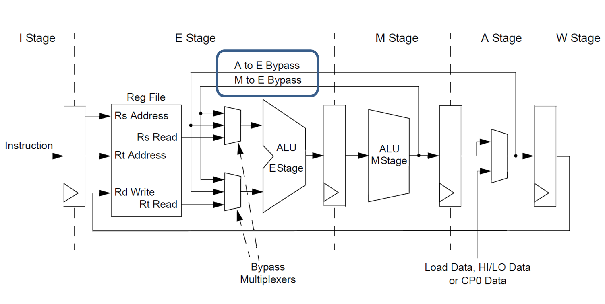
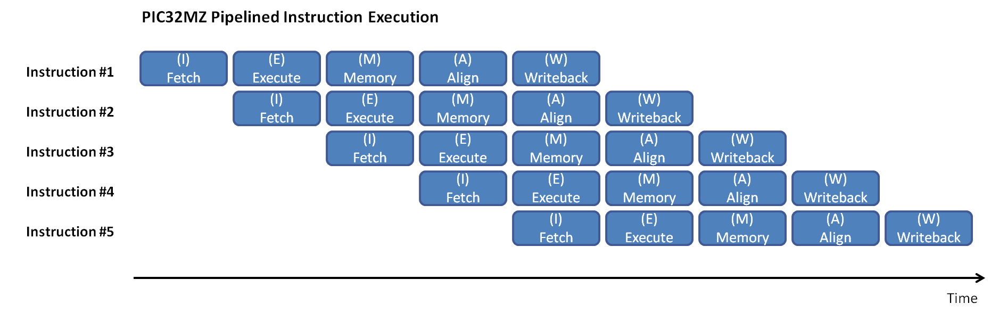

# 3️⃣ Branchless Programming
For this next section, I am going to be cheating a little bit.
I am going to introduce to you a concept that is mostly about optimizing for branch prediction and cache lines.
These things aren't technically concurrency. But they do lead to an introduction of single instruction,
multiple data (SIMD), which is... I don't know... concurrency's cousin or something. It also wasn't immediately
obvious where else this would go. Anyways, branch prediction, branchless programming, data oriented programming and
SIMD, here we go!

## Branch Prediction
Branch prediction and pipelines - Hardware

<figure markdown>
{ width="600" }
<figcaption>
Pipelined Hardware Architecture
<a href="https://microchipdeveloper.com/32bit:mz-arch-pipeline">
Image credit </a>
</figcaption>
</figure>

Pipelined instructions

<figure markdown>
{ width="600" }
<figcaption>
Pipelined Instructions
<a href="https://microchipdeveloper.com/32bit:mz-arch-pipeline">
Image credit </a>
</figcaption>
</figure>

Very basically explained. I do recommend you check out these
[slides](https://ics.uci.edu/~swjun/courses/2023F-CS250P/materials/lec5.5%20-%20Fast%20and%20Correct%20Pipelining.pdf)
from University of California, Irvine for a cursory glance at the fairly complex topic of the hardware involved in
branch prediction.  
For-loop control hazard  
If-statement control hazard  

## Branchless Programming
Short circuiting, think back to bitwise operators  
Unrolling  
If-statement reformulation  

## Data-oriented programming
Find the code in ```m2_concurrency::code::sphere_intersection``` or
[online](https://github.com/absorensen/the-guide/tree/main/m2_concurrency/code/sorting_functions).  
AOS SOA AOSOA - cache lines  
A macro-ish perspective  

## SIMD
Find the code in ```m2_concurrency::code::sphere_intersection``` or
[online](https://github.com/absorensen/the-guide/tree/main/m2_concurrency/code/sphere_intersection).  
Check your system for SIMD hardware.  
Autovectorization  
Explicit SIMD programming  
Doesn't work if you are memory bound, SIMD won't magically make your memory bandwidth increase.  

## Additional Reading
A nice introduction video to [branchless programming](https://www.youtube.com/watch?v=g-WPhYREFjk) by Fedor Pikus.  
A nice introduction video to [SIMD](https://www.youtube.com/watch?v=x5tK5ET6Q1I) by Guillaume Endignoux.  
Wiki on [branch prediction](https://en.wikipedia.org/wiki/Branch_predictor).  
Wiki on [instruction pipelining](https://en.wikipedia.org/wiki/Instruction_pipelining).  
Slides on [instruction pipelining](https://web.eecs.utk.edu/~mbeck/classes/cs160/lectures/09_intruc_pipelining.pdf)
from The University of Tennessee, Knoxville.  

### 🧬 Shader Execution Reordering
[Megakernels Considered Harmful](https://research.nvidia.com/sites/default/files/publications/laine2013hpg_paper.pdf)  
[Wavefront Path Tracing](https://jacco.ompf2.com/2019/07/18/wavefront-path-tracing/)  
[Shader Execution Reordering][1]  

[1]: https://developer.nvidia.com/blog/improve-shader-performance-and-in-game-frame-rates-with-shader-execution-reordering/  
