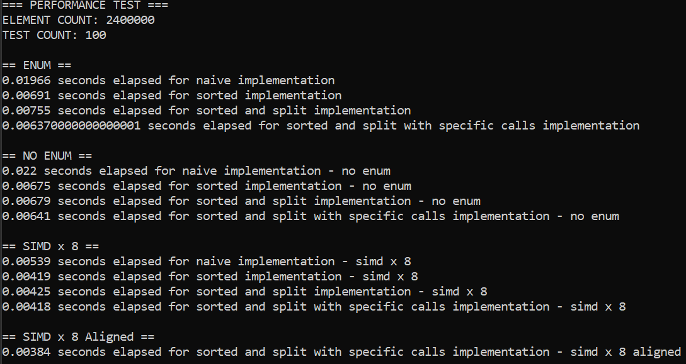
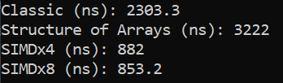

# 3️⃣ Branchless Programming
For this next section, I am going to be cheating a little bit.
I am going to introduce to you a concept that is mostly about optimizing for branch prediction and cache lines.
These things aren't technically concurrency. But they do lead to an introduction of single instruction,
multiple data (SIMD), which is... I don't know... concurrency's cousin or something. It also wasn't immediately
obvious where else this would go. Anyways, branch prediction, branchless programming, data oriented programming and
SIMD, here we go!

## Branch Prediction
While the speed at which CPUs and memory can execute hasn't risen aggresively in these last few years, that doesn't
mean they can't get smarter. One such effort is the hardware supporting branch prediction. Loading a value
from memory can take quite a while, in the mean time the CPU can easily do other stuff or find our which piece
of memory to load next. Below you'll see a small example of a pipelined architecture -

<figure markdown>
{ width="600" }
<figcaption>
Pipelined Hardware Architecture
<a href="https://microchipdeveloper.com/32bit:mz-arch-pipeline">
Image credit </a>
</figcaption>
</figure>

This features several sections executing different commands at the same time and then storing the result in a
register, to be moved on to the next part of the pipeline. This is vastly more efficient, but requires that the
hardware is able to predict which execution path should be followed. In the case of picking the wrong path,
all instructions which were part of the wrong path have to be flushed from the pipeline, and the new execution
path has to be begun. If you have a hard time picturing the scenario, let me paint you a picture with code -

```rust
for index in 0..data.len() {
    if index % 1337 == 0 && index != 0 {
        data[index] -= 1; // Path A
    } else {
        data[index] += 1; // Path B
    }
}
```

Below you can see a more abstract representation of pipelined instructions -

<figure markdown>
{ width="600" }
<figcaption>
Pipelined Instructions
<a href="https://microchipdeveloper.com/32bit:mz-arch-pipeline">
Image credit </a>
</figcaption>
</figure>

If you would like to know more about the hardware side, I do recommend you check out these
[slides](https://ics.uci.edu/~swjun/courses/2023F-CS250P/materials/lec5.5%20-%20Fast%20and%20Correct%20Pipelining.pdf)
from University of California, Irvine for a cursory glance at the fairly complex topic of the hardware involved in
branch prediction.  

Going back to the code from earlier, you can see, any branch predictor worth its salt would predict that path
B would be executed. In a few cases path A will be executed instead, but will be vastly more expensive.

## Branchless Programming
"Branchless programming", is perhaps too big a promise, in all but the simplest cases, it will be
"branch mitigating programming". Branching in code is expensive, so let's look at how we can help the computer,
regardless of parallelism, attain a bit of speed. Again, please checkout the
[slides](https://ics.uci.edu/~swjun/courses/2023F-CS250P/materials/lec5.5%20-%20Fast%20and%20Correct%20Pipelining.pdf)
for an overview of various hazards with code examples. But a few of the basic highlights are control flow, through
short circuiting, unrolling of for-loops (your compiler will often do this automatically), reformulation of
branching through arithmetic. Another problem can be data hazards. If line A is writing to some variable in an
array, which line B depends on, line B cannot commence processing until line A has completed.

The circuiting boolean operators ```a && b``` and ```a || b``` are used everywhere. The short circuiting part
means that because both ```a``` and ```b``` need to be true in order for ```&&``` to evaluate as ```true```, if
```a``` evaluates as false, ```b``` need not be evaluated. Do you see the problem?

It's a branch! Supposing that ```a``` and ```b``` aren't too expensive to evaluate we can reduce the amount of
branching in our code by evaluating both. One way to do so could be -

```rust
if 0 < (a as u8 & b as u8) {
```

or even -

```rust
if 0 < (a as u8 * b as u8) {
```

For ```||``` options can include -

```rust
if 0 < (a as u8 | b as u8)
```

or -

```rust
if 0 < (a as u8 + b as u8)
```

Another way to remove a potential if-statement branch could be to multiply by 0's and 1's the data we might
like to use, by reformulating our code arithmetically -

```rust
fn main() {
    let data: Vec<f32> = vec![0.5; 5];

    let a: bool = true;
    let a_arithmetic: f32 = a as u8 as f32;
    let b: bool = false;
    let b_arithmetic: f32 = b as u8 as f32;
    
    let calculated: f32 = a_arithmetic * data[0] + b_arithmetic * data[1];
    println!("Calculated: {}", calculated);
}
```

As with everything else, this is something you should benchmark before deciding. In terms of readability it is
usually harder to read, so just do it when you need better performance, after asserting correctness first,
of course.

Loop unrolling is the process of doing more work per loop, which also reduces the relationship between actual
work done and administrative control flow work. This unroll will happen a certain amount at a time. Let's
take a quick look at a loop unroll transformation, with an unroll of 4.

```rust
let mut data: Vec<f32> = vec![0.2; 19];
for index in 0..data.len() {
    data[index] *= 2.0;
}
```

And now for the unrolled version -

```rust
    let unroll_size: usize = 4;
    let mut data: Vec<f32> = vec![0.2; 19];
    let full_iterations: usize = data.len() / unroll_size; // 4 = 19 / 4
    
    for index in 0..full_iterations {
        let index: usize = index * unroll_size;
        data[index + 0] *= 2.0;
        data[index + 1] *= 2.0;
        data[index + 2] *= 2.0;
        data[index + 3] *= 2.0;
    }
    
    for index in (full_iterations * unroll_size)..data.len() {
        data[index] *= 2.0;
    }
```

Of course, the tail iterations in the second for-loop won't be as fast the main loop, but again, this usually
something the compiler will do for you in release mode.

## Data-oriented Design
We can take the branchless thinking, and add in optimization for cache lines, from the micro to the macro and
make it part of the way we formulate our data structures and code. This we will use things like sorting and
structuring our data into bigger single objects, while at the same time pulling them apart field by field.
For this, we will take a look at data-oriented design.

A path tracer is sort of like a physics simulation for generating, sometimes physically accuracte, high
quality images. From the cameras point of view, a multitude of rays are sent through each pixel. They travel
forward until they intersect a reason to stop traveling directly forward. Most often this is some form of geometry,
the surface of an object. Geometry is not the same as material. Once a ray intersects geometry, it needs to know
what is the color of the surface that was just hit, and in which direction should it bounce next. This is
dependant on the material. If it hits a perfect mirror, it will change direction much like a billiard ball hitting
the side of a billiards table. If the surface was perfectly diffuse it might change to a direction in a completely
random direction. This calculation is not just a simple lookup, but two entirely different mathematical functions.
They ray will continue to bounce until it either reaches a maximum depth, hits a light source or is otherwise
terminated. If that doesn't make sense, try out [this video](https://www.youtube.com/watch?v=frLwRLS_ZR0).

So why spend your and my time describing path tracers?

They are the perfect case for not just performant heterogeneous systems, but wildly divergent
performant heterogeneous systems. If you launch 100 rays from different starting origins inside the area
covered by a single pixel, even if they all hit the same surface, based on the material, they might scatter in
different directions. They might not all hit the same surface, some leaving the scene and hitting nothing,
resulting in early termination, while some hit material A requiring one scattering function, while others hit
materila B requiring another scattering function. As you can imagine, this gets progressively worse as all rays
scatter round and round in the scene. But we can mitigate the effects of this steadily increasing divergence
by making sure to package, sort, reorder and compact our rays. Instead of looking at a ray at a time, we might
structure our program in various pipeline steps. We might for example try to intersect all rays against the scene,
which is quite expensive, but more on that later, followed by a material/scattering interaction, where we could
group rays by material, allowing us to execute all rays needed a material A scattering event, followed by
executing all rays needing a material B scattering event. It gets worse, but let's take a step back and just
look at how we might handle a whole bunch of rays.

The typical way we might handle a bunch of rays in a path tracer, would be to define each ray as a struct, such as -

```rust
struct Ray {
    origin: Vec3,
    direction: Vec3,
    color: Vec3,
    material: Material, // Enum
}
```

This is just as useful with graphs, as long as we have chosen a formulation of them which allows us to keep
them in arrays instead of floating around in pointer-based structures.
Think back to cache lines now, if we are handling a bunch of rays one at a time, whenever we go to a different
function we are jumping all around in different branches of code, we are loading lots of parts of this ```Ray```
struct in our cache line that we might not even need. If we are primarily in a part of the code where we care
about geometry and intersections, we won't care about material and color. We would care about origin and direction.
We could reformulate the way we kept track of rays to process several data elements at the same time, when in
a relevant part of the code. If we kept a ```Vec<Ray>``` to do this, sending the ```Vec<Ray>``` around from function
to function, we would call this an Array-of-Structs (AoS).

What we could do instead, to only cache exactly what we needed is called Struct-of-Arrays (SoA). We keep all of
our rays in a deconstructed fashion -

```rust
struct VectorOfRays {
    origins: Vec<Vec3>,
    directions: Vec<Vec3>,
    colors: Vec<Vec3>,
    materials: Vec<Material>,
}
```

or we might even take it a step further -

```rust
struct VectorOfRays {
    origins_x: Vec<f32>,
    origins_y: Vec<f32>,
    origins_z: Vec<f32>,
    directions_x: Vec<f32>,
    directions_y: Vec<f32>,
    directions_z: Vec<f32>,
    color_r: Vec<f32>,
    color_g: Vec<f32>,
    color_b: Vec<f32>,
    materials: Vec<Material>,
}
```

Now instead of operating on individual rays, or operating on lists of rays, we can do individual operations on each
and every relevant element, getting them all in our cache line. This require our intersection function to have
a series of loops for each step in the function and requires a bit of refactoring. We gain an additional advantage,
we increase the probability of the compiler autovectorizing our code. More on that in a little bit.

This all seems a bit cumbersome however. If you remember earlier, I told you that these rays might scatter, bounce,
hit different materials and be terminated. Either successfully or unsuccessfully. We need some flexibility back
to make it possible to intersect a bunch of threads, terminate some of them, move others to one queue for material
A, move others to a queue for material B and so on.

Enter... drumroll please... Arrays-of-Structs-of-Arrays (AoSoA).

We could instead use a coarser granularity by storing a number of rays in a shared struct and keep a list of
those structs -

```rust
struct Ray4 {
    origins_x: [f32; 4] = [0.0; 4],
    origins_y: [f32; 4] = [0.0; 4],
    origins_z: [f32; 4] = [0.0; 4],
    directions_x: [f32; 4] = [0.0; 4],
    directions_y: [f32; 4] = [0.0; 4],
    directions_z: [f32; 4] = [0.0; 4],
    color_r: [f32; 4] = [0.0; 4],
    color_g: [f32; 4] = [0.0; 4],
    color_b: [f32; 4] = [0.0; 4],
    materials: [Material; 4] = [Material::default(); 4],
}
```

We can choose a coarser granularity by making this struct any size we like. Within reason, we have a good
chance it might fit on the stack. Now we are free to move around rays, eliminate ones that are terminated,
replace terminated rays with new ones and other such divergence limiting operations. Some libraries such
as [ultraviolet](https://docs.rs/ultraviolet/latest/ultraviolet/) are designed around AoSoA containing
types like ```Vec3x8``` and ```f32x4```.

We could even take things a step further and separate our ray structs.
The fields that are necessary for intersection aren't the same as for propagating colors through bounce
paths. Normally, we might connect disconnected parts of the same underlying object by indices, but as
rays are a transient object which we might bounce between functions it might work better with something
more static like geometry and materials.

## The Road to SIMD
SIMD stands for single instruction multiple data. Basically this whole section has been building to it. SIMD
is a single instruction that operates on an entire ```lane```. A ```lane``` is defined by the architecture
of your CPU. The name to look for is typically named something like SSE or AVX. The CPU of the system used
for benchmarking this section, has multiple SIMD instruction sets - Intel® SSE4.1, Intel® SSE4.2,
Intel® AVX2, Intel® AVX-512. You can program for each specific instruction set or find a cross-platform such as
[ultraviolet](https://docs.rs/ultraviolet/latest/ultraviolet/) to program for multiple architectures.
What I found most important is that my SIMD lanes max out at 512 bits. If I am doing ```f32```-based SIMD
operations I can fit up to 16 floats into a lane.

SIMD programming is a genre unto itself and learning to program it can take a while. If you look at the figure
from earlier showing pipelined instructions, picture each box as being wider. Imagine you are doing the
same operations on N rays at a time. If we have a diverging workload such as in a path tracer, we have to have
some way to handle when some rays are no longer relevant. To handle this SIMD makes heavy use of masks. Masks
are types which distinguish which of the N elements in a lane need to be executed. Another thing SIMD cannot do,
or if it is possible, you probably shouldn't force it to do, is executing different functions at the same time.

Let's look at some code. This program looks at different ways of arranging data and executing a handful of
different, very basic, functions. Note that the memory-to-compute ratio is quite high, as the functions are quite
simple compared to the amount of load operations. SIMD doesn't magically make your program any less memory bound, as
such you have to try and optimize your code before going fully SIMD.

Find the code in ```m2_concurrency::code::sorting_functions``` or
[online](https://github.com/absorensen/the-guide/tree/main/m2_concurrency/code/sorting_functions).  

<figure markdown>
{ width="500" }
<figcaption>
Benchmark for the program in ```m2_concurrency::code::sorting_functions```.
This benchmark was run on my laptop boasting an Intel i7-1185G7, 3.0 GHz with 32GB of RAM. The operating system was
Windows 10. The L1/L2/L3 caches were 320 KB, 5 MB and 12 MB respectively. The CPU supports
Intel® SSE4.1, Intel® SSE4.2, Intel® AVX2, Intel® AVX-512.
</figcaption>
</figure>

As you can see, if we generate a huge list of different functions to call, we can gain an immense amount of
performance simply by sorting our data. We can either sort it ourselves, or sit it as it accumulates, by putting
it in different lists. The other major performance gain we get is by introducing SIMD. Note that the performance
gain isn't huge when changing to SIMD. This is a case where each function is small enough that we are mostly
memory bound. SIMD does nothing to alleviate that, except try to draw on even more of the memory bandwidth.

If we instead look at code which uses an actual function from path tracing, in this case sphere intersection,
we are doing much more compute per memory load and can see a significant increase in performance. Here's
a sample of the code to show you what SIMD programming looks like -

```rust
fn ray_sphere_intersect_x8(
    sphere_o: &uv::Vec3x8,
    sphere_r_sq: &uv::f32x8,
    ray_o: &uv::Vec3x8,
    ray_d: &uv::Vec3x8,
) -> uv::f32x8 {
    let oc = *ray_o - *sphere_o;
    let b = oc.dot(*ray_d);
    let c = oc.mag_sq() - sphere_r_sq;
    let descrim = b * b - c;

    let desc_pos = descrim.cmp_gt(0.0);

    let desc_sqrt = descrim.sqrt();

    let t1 = -b - desc_sqrt;
    let t1_valid = t1.cmp_gt(0.0) & desc_pos;

    let t2 = -b + desc_sqrt;
    let t2_valid = t2.cmp_gt(0.0) & desc_pos;

    let t = t2_valid.blend(t2, uv::f32x8::splat(std::f32::MAX));
    let t = t1_valid.blend(t1, t);

    t
}
```

As you can see, in this case I only use functions implemented directly by utraviolet's ```uv::Vec3x8``` and
```uv::f32x8``` types.

Be sure to check out the 4 references at the top of the code.
Find the code in ```m2_concurrency::code::sphere_intersection``` or
[online](https://github.com/absorensen/the-guide/tree/main/m2_concurrency/code/sphere_intersection).

<figure markdown>
{ width="500" }
<figcaption>
Benchmark for the program in ```m2_concurrency::code::sphere_intersection```.
This benchmark was run on my laptop boasting an Intel i7-1185G7, 3.0 GHz with 32GB of RAM. The operating system was
Windows 10. The L1/L2/L3 caches were 320 KB, 5 MB and 12 MB respectively. The CPU supports
Intel® SSE4.1, Intel® SSE4.2, Intel® AVX2, Intel® AVX-512.
</figcaption>
</figure>

In this case, the vanilla struct-of-arrays code performed worse. In some cases you can hope for autovectorization,
where the compiler, in the case where you have factored your data in a way that allows it, will create a SIMD
version of your code. This is usually more likely if you turn on your compilers native targetting flag.

With compilers you can tell it which platforms to compile for. If you tell it to compile exclusively for YOUR
platform it can make use of optimizations and commands specific to your system. This might make it perform
significantly worse on other systems though.,

I will leave you with one thing if you are memory bound, SIMD won't magically make your memory bandwidth increase.  

Also, here's [a nice blog post](https://www.rustsim.org/blog/2020/03/23/simd-aosoa-in-nalgebra/) about
the performance implications of AOS, SOA and AOSOA.

## Additional Reading
A nice introduction video to [branchless programming](https://www.youtube.com/watch?v=g-WPhYREFjk) by Fedor Pikus.  
A nice introduction video to [SIMD](https://www.youtube.com/watch?v=x5tK5ET6Q1I) by Guillaume Endignoux.  
Mike Acton on [Data-oriented Design](https://www.youtube.com/watch?v=rX0ItVEVjHc).  
Wiki on [branch prediction](https://en.wikipedia.org/wiki/Branch_predictor).  
Wiki on [instruction pipelining](https://en.wikipedia.org/wiki/Instruction_pipelining).  
Slides on [instruction pipelining](https://web.eecs.utk.edu/~mbeck/classes/cs160/lectures/09_intruc_pipelining.pdf)
from The University of Tennessee, Knoxville.  

### 🧬 Shader Execution Reordering
The sorting, compacting and reordering hinted at for path tracing earlier is actually a pretty hot button topic
in path tracing and has recently gotten hardware support.  

[Megakernels Considered Harmful](https://research.nvidia.com/sites/default/files/publications/laine2013hpg_paper.pdf)  
[Wavefront Path Tracing](https://jacco.ompf2.com/2019/07/18/wavefront-path-tracing/)  
[Shader Execution Reordering][1]  

[1]: https://developer.nvidia.com/blog/improve-shader-performance-and-in-game-frame-rates-with-shader-execution-reordering/  
