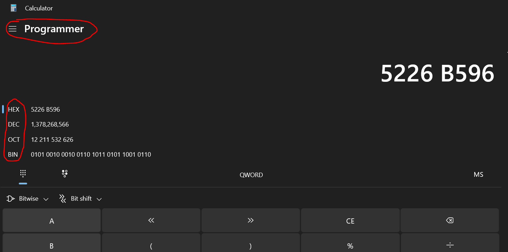

# 2️⃣ Integers
So far we have mainly used integers as indices into memory (arrays), but other than being good at
doing integer math, integers also have a few other characteristics going for them. They have
uniform precision across their entire span, they are good for compressing data and integer-based
calculations are quite a bit more energy efficient than floating point calculations.

Before I go into how a computer typically represents signed and unsigned integers,
we are going to take a look at how we represent numbers in different bases without a computer.
You probably know numbers in base 10. But what about base 2 and base 16?

## Binary - Base 2
Base 2 is what you'll know as binary. Binary is at the absolute core of how computers represent
numbers, as each digit can be represented as either being on or off. 1 or 0.
We have 2 possible values for each digit in binary numbers.
In base 10 the number 18 can be represented as the following -

1x10<sup>1</sup> + 8x10<sup>0</sup>

There is of course an infinite amount of 0's in front of 18, which we don't see because they
are implied. Base 2 would represent the number as 0b10010 (note the 0b prefix).

Let's try and represent the number 18 in base 2.

1x2<sup>4</sup> + 0x2<sup>3</sup> + 0x2<sup>2</sup> + 1x2<sup>1</sup> + 0x2<sup>0</sup>

Or if we resolve the digits

1x16 + 0x8 + 0x4 + 1x2 + 0x1

Removing the zeroes -

1x16 + 1x2  

So 0b10010 is the same as 18 in base ten.

## Hexadecimal - Base 16
Another representation is hexadecimal. It is base 16. So what do you do when you now have
16 values per digit?

You start including letters! Hexadecimal numbers have a range for each digit from 0 to F.
So 0, 1, 2, 3, 4, 5, 6, 7, 8, 9, A (10), B(11), C(12), D(13), E(14) and F(15). Why would
anyone want to use a system like this?

We could write the same in hexadecimal by writing 0x12 (note the 0x prefix) or -

1x16<sup>1</sup> + 2x16<sup>0</sup>

Which amounts to -

1x16 + 2x1

But why would you want to do this? Simple, it functions like a contraction of binary.
Each F represents 4 bits. So if we wanted to indicate an entire byte (8 bits) turned on,
which is the same as the number 255, we could either write 255 or 0xFF. That case is
simple enough. Everyone can remember 255. We could just use base 10 for that and save
us having to learn hexadecimal representations. Stress on the representation,
whether you write base 2, 10 or 16, in hardware it is all base 2. But where
hexadecimal really shines is when we want to manipulate individual bytes or bits.

There is something called bitwise operators, don't worry about it, it is one of
the next sections (s3). We could use the bitwise operator & (AND) on two numbers.
& would compare every bit of the two numbers one at a time and output a 1 if
both bits were 1. It would output a 0 in all other cases. So if we gave it
the two binary numbers, the mask 0b00000000000000001111111100000000 and some input number
like 0b01010010001001101011010110010110, we would get an output value of
0b00000000000000000011010100000000. This allows us to just isolate the active bits
in the second byte from the right.

This is really hard to read. If we had instead encoded our mask in hexadecimal,
we would write 0xFF00 for our mask. We rarely have to write out our inputs, but
in this case it can be represented as 0x5226B596. If you are on Windows, you can
find the Calculator app. If you click in the upper left corner, you can find the view
called "Programmer". On the left side you will see various numerical representations
like HEX, DEC, OCT and BIN. Having these sorts of calculators can be very handy
to quickly transfer from one representation to another.

<figure markdown>
{ width="800" }
<figcaption>
You can find other numerical representations in calculator apps.
</figcaption>
</figure>

## Unsigned Integers
Unsigned integers are more or less represented as a raw binary number.
The range of possible numbers to represent with an unsigned integer is
2<sup>n</sup>-1. So an 8-bit number can represent the range 0..255. You
might wonder why the -1 is there. It's because 0 also has to be represented.

You can multiply, divide, add, subtract and all the other standard stuff.
But what happens when you go over or under the representable range?
This is called over- and underflow. It is defined for unsigned integers,
but undefined for signed integers. Signed means it can also represent
negative numbers, where as unsigned integers can exclusively represent
non-negative numbers.

Overflow in unsigned integers is defined as being the remaineder of dividing
the desired number by the maximum representable number. So if you are adding
128 to 157, both using 8-bit unsigned integers, which has a maximum value of
255, the desired number is 285. This results in an overflowed value of 30.
Read [this link](https://www.learncpp.com/cpp-tutorial/unsigned-integers-and-why-to-avoid-them/)
about some of the considerations regarding unsigned integers. The author
carries the opinion that you should mainly use unsigned integers for
stuff like array indices (which are all required to be ```usize``` in Rust)
or as variables which you know are being manipulated as bitfields instead of
numbers.

A special type of unsigned integer is the ```usize```. On a 32-bit operating system,
where you might recall we can only address around 2 GB of memory, the ```usize``` will
have a size of 32 bits. On most modern 64-bit operating systems, the ```usize``` will be
a 64-bit unsigned integer. Rust demands that you convert your indices to ```usize```,
where as C++ implicitly converts your integers to ```usize```. So what happens
if you index an array with a 32-bit signed integer in C++? This is very common,
and in most cases it is fine. Except when that signed integer is negative. In
which case we have used a type that allows us this undesired behavior. I ran this
code in an online C++ environment -

```c++
// Online C++ compiler to run C++ program online
#include <iostream>
#include <vector>

int main() {
    // Write C++ code here
    std::cout << "Hello world!";
    std::vector<int> array{0, 1, 2, 3, 4};
    int some_index{-2};

    std::cout << array[some_index];

    return 0;
}
```

When running it for other negative indices than -2 it prints the value 0. This is probably
uninitialized memory which hasn't been used yet. If we index with -2 we get the value
33. Think back to when we looked at memory hierarchies and pointer arithmetic in ```m1::s0```.
This is actually a pointer being manipulated. We weren't supposed to go back beyond the start
of the array, but we just did!

This is bad, and you shouldn't do it.

## Signed Integers
Signed integers are a bit more complex. They can carry both positive and negative numbers.
The outermost bit is reserved as a sign bit, denoting whether the number is positive or
negative. Read about the range of signed integers as well as the concept two's complement
[here](https://en.wikipedia.org/wiki/Two%27s_complement).

In the case of signed integers, over- and underflow are undefined in general. However,
overflow for signed integers is
[defined in Rust Debug](https://doc.rust-lang.org/book/ch03-02-data-types.html#integer-overflow)
. You can se more about the types [in Rust here.](https://doc.rust-lang.org/reference/types/numeric.html)

## 5️⃣ Additional Reading
You can take a look at the wiki for [integers](https://en.wikipedia.org/wiki/Integer_(computer_science)),
or you might prefer [lecture slides](https://www.cs.utexas.edu/users/witchel/429H/lectures/02-bits-ints.pdf)
or even a video by your favourite [performance YouTuber](https://www.youtube.com/watch?v=fYMeYrIWnOc).
