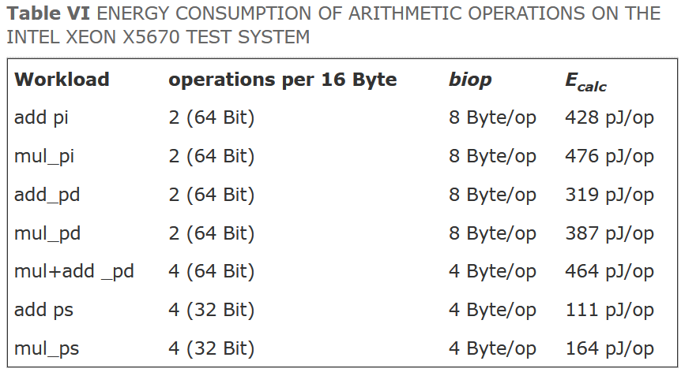
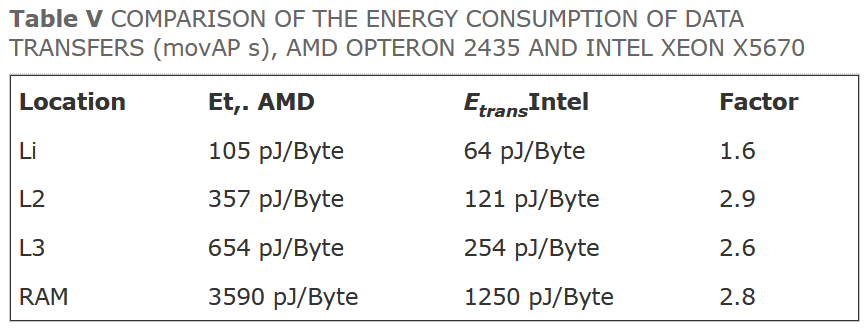

# 2️⃣ Energy Efficiency
From experience, not a lot of people who daily write quite long-running code, necessarily
connect the two dots computing and energy consumption/CO<sub>2</sub> emissions. Anything you
do with a computer consumes some form of electricity. Including whatever you do on the internet
or download from the internet. Like downloading the contents of this page for you to read.
Generally, if your code is faster, it is greener. If your code
downloads less, it is likely to be greener. If you use a lower precision, generally,
it is likely to be greener. If you accumulate work to do, as in batching, instead of
firing up the system for every single request, it is likely to be greener. If you
preprocess the data at the edge before sending it to the cloud, it is likely to be greener.
If your code is faster, it is likely to greener. If your code is faster, it is likely to be cheaper.

I will primarily focus on the energy efficiency of things you have direct control over. Once you
have learned that, you should be able to infer the rest. Why not make this a 3️⃣ topic?
Because quite a few people don't seem to be making the aforementioned connection, and I find it
important that people start evaluating the value that is generated from what they are doing.
Training and running neural networks do not grab energy out of the ether. They have a cost.
A resource expenditure, and the value you attain from those systems should be greater than
the consumption.

<figure markdown>
{ width="800" }
<figcaption>
The estimated power consumption of some arithmetic operations on an AMD and an Intel
CPU. Note that 32-bit integer is missing. The operations ending in i are integers,
d for double and s for single.
<a href="https://ieeexplore.ieee.org/document/5598316">
Image credit </a>
</figcaption>
</figure>

Unfortunately, the 32-bit integer data wasn't there, and it is an older measurement.
But, it should give you an indication of the scale of how much cheaper a 32-bit
float is compared to a 64-bit float. Now this was just for compute, let's
see what it's like for memory access -

<figure markdown>
{ width="800" }
<figcaption>
The estimated power consumption of memory accesses on an AMD and an Intel
CPU.
<a href="https://ieeexplore.ieee.org/document/5598316">
Image credit </a>
</figcaption>
</figure>

As you can see, retrieving a value all the way from RAM instead of a cache
is vastly more expensive. If you think back to the cache lines from ```m1```
imagine lowering the precision of your data from 32-bit floats to 16-bit or
even 8-bit. Imagine many additional data elements you could fit in a single
cache line. Elements which could be reused and kept in cache.

## Additional Reading
[Efficient Processing of Deep Neural Networks](https://arxiv.org/pdf/1703.09039.pdf) is a highly
recommended tour through various concerns and techniques in reducing the energy footprint of
neural networks.  
[A recorded lecture of Vivienne Sze about energy efficiency in AI](https://www.youtube.com/watch?v=WbLQqPw_n88).  
[Characterizing energy consumption of CPUs](https://ieeexplore.ieee.org/document/5598316).  
[Green Computing](https://en.wikipedia.org/wiki/Green_computing).  
[What is green coding?](https://geekflare.com/green-coding/).  
The somewhat controversial paper
[Ranking programming languages by energy efficiency](https://www.sciencedirect.com/science/article/pii/S0167642321000022)
.
