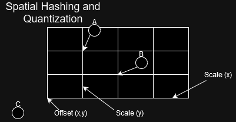
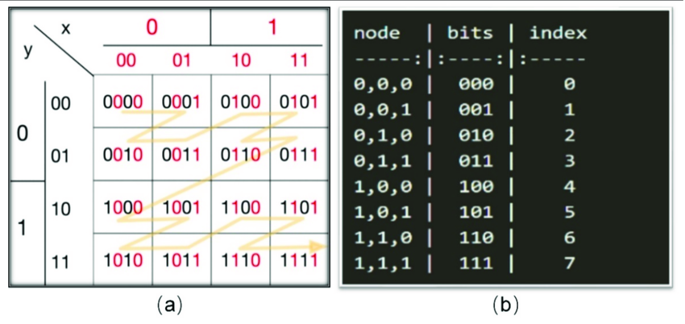
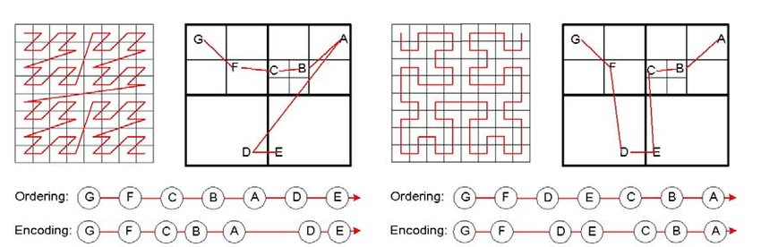

# 3️⃣ Bit Tricks
There's a number of different tricks you can do with bits, and I won't even attempt to do all of them.
But I'll briefly introduce three different things you can do. Spatial hashing, Morton codes and the
legendary fast inverse square root.

## Spatial Hashing
Ok, so first off let's look at what we can do with encoding multidimensional data into a single number.
This can be really useful for encoding 2- or 3D information. In fact, so nice that my thesis was basically about
how to extend this concept into how we could design point cloud rendering systems.

First off let's try just encoding three integers into a single integer. ```x``` will reside in bits 40-59,
```y``` will reside in bits 20-39 and ```z``` will reside in bits 0-19.

```rust
let x: u64 = 7;
let y: u64 = 5;
let z: u64 = 2;

let x_hash: u64 = 0x0FFF_FF00_0000_0000 & (x << 40);
let y_hash: u64 = 0x0000_00FF_FFF0_0000 & (y << 20);
let z_hash: u64 = 0x0000_0000_000F_FFFF & z;
let hash: u64 = x_hash | y_hash | z_hash;
```

So we have three usages of bitwise operators here. We shift, AND and OR. First we shift our initial number to start
from the correct bits. We mask with the bitwise AND to ensure that we stick within the allotted bits. This also
has the effect of truncating the 44 most significant bits of ```x```, ```y``` and ```z```. So we have to keep
track of what it is we trying to hash. Finally, we bitwise OR the whole thing.

We could also do the masking before the shift for something even cleaner -

```rust
let x: u64 = 7;
let y: u64 = 5;
let z: u64 = 2;

let x_hash: u64 = (x & 0xFFFFF) << 40;
let y_hash: u64 = (y & 0xFFFFF) << 20;
let z_hash: u64 =  z & 0xFFFFF;
let hash: u64 = x_hash | y_hash | z_hash;
```

We can of course also just start with a 0 and continually OR with the shifted and masked values.

```rust
let x: u64 = 7;
let y: u64 = 5;
let z: u64 = 2;

let mut hash: u64 = 0;
hash |= (x & 0xFFFFF) << 40;
hash |= (y & 0xFFFFF) << 20;
hash |=  z & 0xFFFFF;
```

Since we have ensured we do not have any overlaps between our shifted and masked numbers, the ORs can be replaced
by additions. We are also always free to use multiplication instead of the shifts, but the intent is less clear
and you have to be sure that it is still doing the same as the corresponding shift, which again, is defined
differently depending on the stype, direction and language.

```rust
let x: u64 = 7;
let y: u64 = 5;
let z: u64 = 2;

let mut hash: u64 = 0;
hash += (x & 0xFFFFF) * 1_099_511_627_775;
hash += (y & 0xFFFFF) * 1_048_575;
hash +=  z & 0xFFFFF;
```

Ok, so just linearizing three integers into one integer is pretty clear. We can of course easily reconstruct
the three numbers by just doing the opposite operations.

```rust
let x: u64 = 7;
let y: u64 = 5;
let z: u64 = 2;

let x_hash: u64 = (x & 0xFFFFF) << 40;
let y_hash: u64 = (y & 0xFFFFF) << 20;
let z_hash: u64 =  z & 0xFFFFF;

let hash: u64 = x_hash | y_hash | z_hash;

let x: u64 = hash >> 40 & 0xFFFFF; // x == 7
let y: u64 = hash >> 20 & 0xFFFFF; // y == 5
let z: u64 = hash & 0xFFFFF; // z == 2

```

Easy peasy. We could easily split this code into encode and decode functions. Linearization of 3D coordinates
would be good for encoding sparse data. If you used this for actual indices into an array you would have to allocate
more memory than your machine could possibly have. Instead, you can use the u64, or you could even do a 32-bit
or 16-bit encoding using less bits from the original data, as keys into a hash map.

Now, let's do this with floats instead! This requires us to use quantization. With quantization we want to take
a float and adapt it to the domain of an integer. We need to know WHERE our domain resides and how BIG it is.

```rust
// This would be given for this specific grid
// If we aren't TOO bothered by the loss of precision we can
// multiply by the inverse of the scaling term.
let x_scale: f32 = 5.0f;
let x_offset: f32 = 0.32f;

let y_scale: f32 = 4.0f;
let y_offset: f32 = 3.50f;

let z_scale: f32 = 2.0f;
let z_offset: f32 = 0.42f;


let x: f32 = 7.2f;
let y: f32 = 5.5f;
let z: f32 = 2.2f;

let x_quantized: u64 = ((x - x_offset ) / x_scale) as u64;
let y_quantized: u64 = ((y - y_offset ) / y_scale) as u64;
let z_quantized: u64 = ((z - z_offset ) / z_scale) as u64;

let x_hash: u64 = (x_quantized & 0xFFFFF) << 40;
let y_hash: u64 = (y_quantized & 0xFFFFF) << 20;
let z_hash: u64 =  z_quantized & 0xFFFFF;

let hash: u64 = x_hash | y_hash | z_hash;
```

We use an offset to move all of the values to have the smallest represented value start at 0. We then scale
our float to have the maximum float value be the biggest integer we want to use. Usually this will involve finding
the maximum float value in our data set and knowing how many indices we at most want in our grid. I have
made a small example below -

<figure markdown>
{ width="600" }
<figcaption>
Spatial hashing implicitly defines a grid. That grid can have offsets and scales. Just be sure you don't end
up not covering your domain without having a definition for points falling outside the domain.
</figcaption>
</figure>

As you can see we risk having a value (C) reside outside of our quantized domain, we should have a plan for what
to do if that happens or make sure that the float domain is completely covered by our quantized domain. When
we quantize our floats we inevitably have some loss of precision. This loss is represented by the arrows pointing
from values A and B to the nearest grid point. It is all rounding down, when done in this fashion. We could have
instead chosen to round our numbers to the nearest integer. If we use this spatial hash as the key into a hash map
we could keep a vector of points as the value, like ```HashMap<u64, Vec<[3; f32]>>```. In that case we could have a
3D point like above. Find the spatial hash key for the 3D point, and then push our 3D point onto the Vec. This
would essentially be binning. We would eventually have buckets of every point within some 3D space which we defined
through our spatial hash function.

If we wanted to get really nasty about it, we could use principal component analysis of the covariance matrix of
the points to figure out a new rotated coordinate system. Then we would have to introduce a transformation term,
in which case we might as well replace the scale and offset with a full 4D matrix, but it would allow for us to
maximize the precision of our representation.

## Morton Codes / Z-Order Curves
[Morton encoding](https://www.forceflow.be/2013/10/07/morton-encodingdecoding-through-bit-interleaving-implementations/)
is the natural extension of spatial hashing. We just saw a grid resulting from segmenting one number to represent more
numbers. But what if interleaved the bits instead? This results in what is known as a
[Z-Order Curve](https://en.wikipedia.org/wiki/Z-order_curve), encoded and decoded through Morton coding.

```rust
let x: u32 = 8;
let y: u32 = 1;
let z: u32 = 2;

let component_count: u32 = 3;
let bits_of_precision: u32 = 10;

let mut encoded: u32 = 0;
let mut mask: u32 = 1;
for index in 0..bits_of_precision {
    encoded |= ((x & (1 << index)) << 2*index);
    encoded |= ((y & (1 << index)) << (2*index + 1));
    encoded |= ((z & (1 << index)) << (2*index + 2));
}

```

Some mad lads looked at
[optimization](https://www.forceflow.be/2013/10/07/morton-encodingdecoding-through-bit-interleaving-implementations/)
of Morton codes. The above code snippet was just a Rust version of what was written in the aforementioned
blog post under the "For-loop based method"-heading. The blog post also has a nice visualization of what
Morton codes look like, as opposed to the grid.

<figure markdown>
{ width="800" }
<figcaption>
A four bit, two-dimensional Morton code.
<a href="https://www.researchgate.net/figure/The-work-principle-of-Morton-codes-a-Morton-code-and-traversal-ordering-for-a-2D-grid_fig4_354791070">
Image credit </a>
</figcaption>
</figure>

In the blog post there is even a lookup table (LUT) version mentioned which removes all of the loops.
Using LUTs yields an advantage which increases with the size of the numbers as the number of iterations
in the for-loops increases. It does however require you to copy paste or generate a LUT which you can reuse.
You tradeoff a lot of for-loops for doing a few
memory look-ups instead. It seems to be the favoured way of doing it when you search for Mortorn encoding libraries.

<figure markdown>
{ width="800" }
<figcaption>
The spatial layout of Morton coding compared to Hilbert coding.
<a href="https://www.researchgate.net/figure/Spatial-ordering-and-encoding-based-on-the-Morton-curve-left-and-the-Hilbert-curve_fig2_220616180">
Image credit </a>
</figcaption>
</figure>

We can use Morton codes to do stuff like creating spatial data structures and interestingly, this is how
textures are stored on GPU's. This allows for better cache coherence when working with textures. Imagine
you want to draw some point between 4 different pixels of an image. You can either just go to the nearest
pixel in the texture, or you can do some filtering function between the 4 nearest pixels, like bilinear
interpolation. Then we need good locality to get the 4 pixels as quickly as possible. If you go back and look at the
spatial ordering of the Morton layout, you'll see that if you get lucky, the four pixels can be either
very close to each other in memory, or pretty close. They aren't an entire row apart.

<figure markdown>
{ width="800" }
<figcaption>
The effect of choosing nearest neighbor interpolation instead of linear interpolation.
<a href="https://learnopengl.com/Getting-started/Textures">
Image credit </a>
</figcaption>
</figure>

## Fast Inverse Square Root
Previously, I wrote that you should never do bitwise operations on floating point numbers. Well, now we're
gonna look at a, if not the most, famous black magic methods directly manipulating the bits of a floating
point number. This method comes from computer graphics where the normalization of vectors (changing their
magnitudes to 1), is constantly used to ensure that the directions are correct. To do this you divide each
element of the vector by the length. To find this length we need the square root of the sum of each element squared.
The square root is quite expensive to compute and as you may recall, multiplication is much faster than
division. In most graphics, the loss of precision in multiplying by the inverse value instead of division
by the value, is acceptable. And thus if we could find the inverse square root of the sum of squared elements,
it would be faster.

This is where this gem known from the development of Quake 3 enters the scene -

```c++
float Q_rsqrt( float number )
{
 long i;
 float x2, y;
 const float threehalfs = 1.5F;

 x2 = number * 0.5F;
 y  = number;
 i  = * ( long * ) &y;                       // evil floating point bit level hacking
 i  = 0x5f3759df - ( i >> 1 );               // what the fuck?
 y  = * ( float * ) &i;
 y  = y * ( threehalfs - ( x2 * y * y ) );   // 1st iteration
// y  = y * ( threehalfs - ( x2 * y * y ) );   // 2nd iteration, this can be removed

 return y;
}
```

It even has its [own wikipedia page](https://en.wikipedia.org/wiki/Fast_inverse_square_root). To be honest,
I watched [this video](https://www.youtube.com/watch?v=p8u_k2LIZyo) about it some years ago, and can't quite
remember how it works. It casts the float to an integer (long), and then manipulates the underlying bits through
knowledge of the mantissa. It casts it back to a float, and then uses a single iteration of Newton's method for
reducing the error. If you read the rest of the wiki, you will see there have been subsequent improvements to
the accuracy, elimination of undefined behavior. The algorithm resulted in a four times faster execution
than just getting the square root directly. Short after, hardware implementations started cropping up which
outperformed it both in performance and in accuracy. You can even find it in WGSL through calling
```inverseSqrt(data)```.

Often you can find hardware implementations of often needed mathematical functions. Especially for GPU programming
this can yield a performance boost. These are called intrinsic functions. Usually, they will have a lower precision.
The instrinsic cosine might be computed in 24-bits for example, but will probably outperform the software version
by a large margin, if the hardware support is available.

## 5️⃣ Additional Reading
If you've read all of this, you should now be ready to look at quantization and quantization aware training
[in PyTorch](https://pytorch.org/blog/introduction-to-quantization-on-pytorch/).
