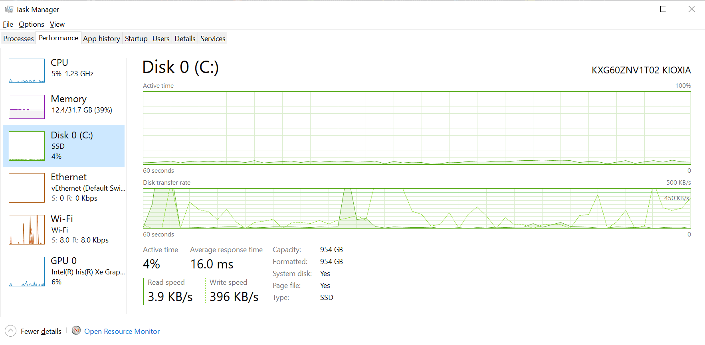
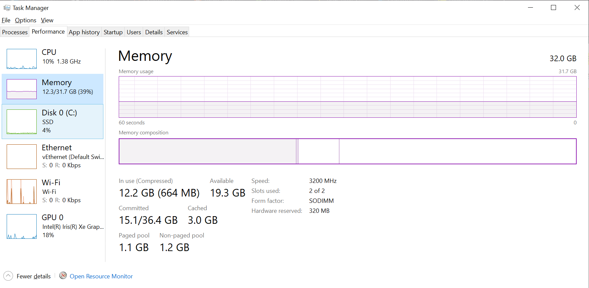
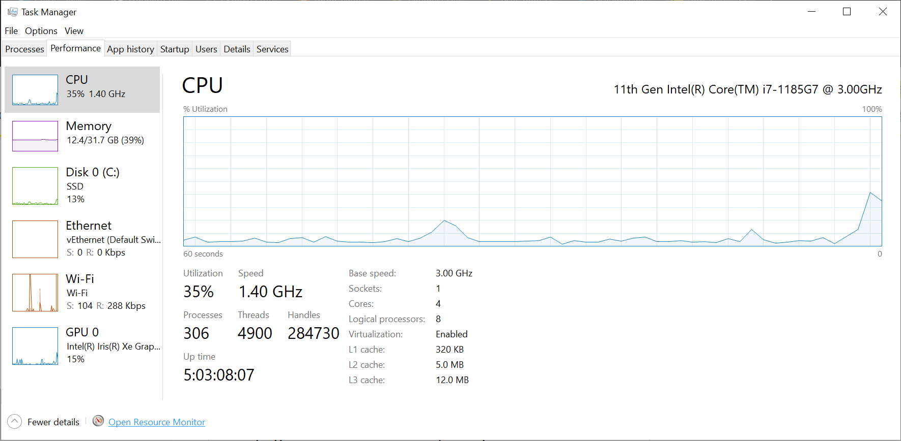
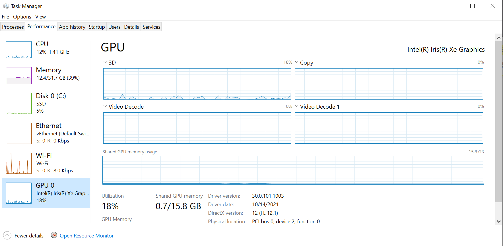
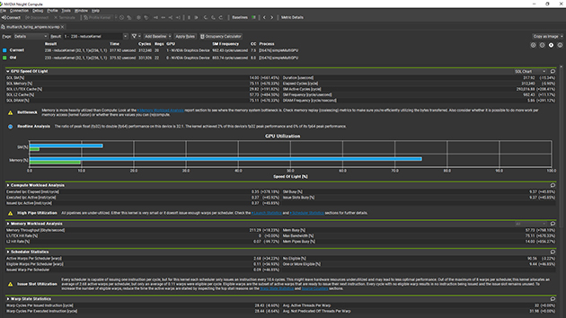
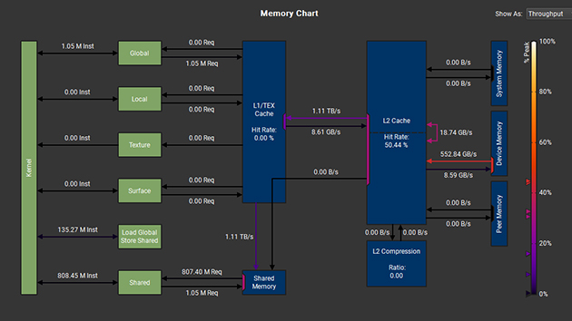

# 3️⃣ Profilers
So we just did some preliminary timing of your program. It would have taken even less time to just look at your
systems performance monitor, although that would only allow you to guess about what was taking most of the
processing time. Once you have tried both timing your code, and you've gotten what you could out of the
system performance monitor, it might be time to install and use a profiler.

If you are profiling Rust, make sure you leave in the
[debug symbols](https://nnethercote.github.io/perf-book/profiling.html#debug-info) when compiling. Otherwise the
profiler won't be able to tell you which function is which.

## System Monitors
Let's start off looking at your system monitor to see where
something might be obviously wrong. I will be using Task Manager on Windows to exemplify where you
might look for the various bottlenecks. The quickest way to check is following the memory hierarchy.
Disk, memory, CPU and then optionally GPU. If your disk is maxed out, then a good idea for your next optimization
might be to focus on disk utilization.

### Disk
In the disk tab we can see the name of the disk, its maximum read and write speeds, usually read will be faster
than write. You can also see whether you are mostly using read or write bandwidth.

<figure markdown>
{ width="800" }
<figcaption>
The Disk tab of Task Manager.
</figcaption>
</figure>

This is where you want to start, but disk can suffer some spillover from memory. If you have used all of your
memory, the operating system will use swapping. If you had say, 16 GB of memory, and you are full up, but try to
allocate more memory in your progran, the operating system can either throw a "out of memory" error or it can
make use of the disk to supplement the memory. It will write some of the data currently residing in memory to a
swap file and write it to disk. It is possible to configure how big a swap file the operating system will create at
most, but in any case, if your system has to use a swap file, your program is going to be slow. So either put in
more RAM or optimize your program to use less memory.

### Memory
In the memory tab, we can see how much physical memory is present and how much is currently being used.
Interestingly, we can also see what the frequency of the memory is. It's named "Speed" in Task Manager.

<figure markdown>
{ width="800" }
<figcaption>
The Memory tab of Task Manager.
</figcaption>
</figure>

Other than that, you mainly need to worry about one thing. If one of the numbers on the page is greater than
the physical amount of memory you have, you are probably swapping to disk. If the memory usage is also constantly
rising, you should probably think carefully about whether you might have a memory leak, or you are allocating
when you weren't intending to.

### CPU
In the upper corner we can easily checkout which model of CPU we have, going to the bottom we can see the size of
our caches, the base clock frequency of cores and how many cores are available in our CPU. We can see how many
processes and threads are running. When you see processes think apps. There can be multiple threads running for each
process. We won't get an exact indication of how well we are using each core in this configuration, but if we at no
point see utilization above 50%, then we probably aren't using all cores to the fullest.

<figure markdown>
{ width="800" }
<figcaption>
The CPU tab of Task Manager.
</figcaption>
</figure>

But, I do have to remind you of one thing. High utilization is not the same as well performing code.
You can very easily max out the utilization of all cores on your system, but sometimes, optimizing your
code will result in less utilization, as doing less is often a good strategy. An indicator that the
program dominating resource usage is single threaded, or at least not very well parallelized will be
if you have a fairly constant use of 1/N, N being the amount of cores. So, if we have a system with
4 cores, and no hyperthreading, an almost constant usage of 25%, with a few spikes here and there, we
have very poor parallelization of our CPU code. To get a more detailed per core view, you can click the resource
monitor button in the bottom left.

### GPU
If we are using the GPU in our application, we can also go to the GPU tab. Once again, in the upper right we can
see which GPU we are using. In the bottom, we can see the driver version. DirectX version refers to the version
of DirectX (Windows graphics and compute API) that the system supports. The laptop I used to take the screenshot
with has what is called an integrated GPU. It shares
its memory with the CPU. But in this case, the entire system has 32 GB of memory, 16 of which is shared by the GPU.
While this may result in higher transfer rates to the GPU, the bandwidth internally
(when you access memory in a buffer you have already transferred) is usually less than a dedicated GPU.

<figure markdown>
{ width="800" }
<figcaption>
The GPU tab of Task Manager.
</figcaption>
</figure>

In this configuration, we have 4 windows for utilization monitoring. We can actually click on the titles of the
windows to choose what to show. The one called 3D will show utilization, both for graphics and pure
compute workloads. Copy is our transfer utilization. On dedicated cards there will often be dedicated sections for
CPU-GPU transfers and for GPU-CPU transfers. Video decode also has dedicated hardware and is typically something
you might see used during streaming video, such as watch videos streamed from the internet. Or video processing
if you need to encode and compress video directly from your GPU.

## Choosing a Profiler
If your own system's performance monitor was not detailed enough, you can make use of dedicated profilers.
Profilers can be hard to install and something that depends on your use case. Below is a non-exhaustive list
of profilers you can try out.

* [A list of Rust profilers from the Rust Performance Book](https://nnethercote.github.io/perf-book/profiling.html)
* Web Browser
* [perf](https://en.wikipedia.org/wiki/Perf_(Linux))
* [RenderDoc](https://renderdoc.org/)
* [AMD Radeon GPU Profiler](https://gpuopen.com/rgp/)
* [Nvidia Visual Profiler](https://developer.nvidia.com/nvidia-visual-profiler)
* [Nsight Systems](https://developer.nvidia.com/nsight-systems)
* [PyTorch profiler](https://pytorch.org/tutorials/recipes/recipes/profiler_recipe.html)
* [tracy](https://github.com/wolfpld/tracy)

Profiling on Windows is a bad experience if you are outside Visual Studio. You can try using Linux tools like perf
through WSL2 on Windows. How to profile your specific GPU on Windows through WSL2, I am not quite sure. You might
just be able to profile outside of WSL2 using the GPU profiler provided by the GPU vendor (AMD, Nvidia, Intel).

## How to work with Profilers
So what happens when you finally have a working profiler?

One view you can go for is the sorted hot spot list. A lot of profilers will measure a list of the functions
taking the most significant part of the execution time. Sometimes, it will by default be a cumulative list,
resulting in the main function being on top and you having to explore down the list to find likely candidate
functions for optimization. It can be a good idea to find where to turn this off to just show which functions
individually are using the most time. You might have to switch between the two views. Sometimes you can also
get the profiler to show the hot spots of individual lines of code, which will be highlighted both by color and
a nifty percentage.

If use a GPU profiler instead, you can get views like your occupancy and speed relative to the
theoretical peak usage and what your memory and compute utilization is. In profiling, at least pure compute
workloads, not necessarily graphics, you need to keep track of two core metrics. Compute and memory utilization.
If the memory utilization is high, but the compute utilization is low, the program is memory bound. You can
mitigate this by optimizing the way you work with memory. You could do less memory accesses, make increased use
of shared memory or registers, or even do warp shuffling. If you are compute bound, because the compute
utilization is high, but the memory utilization is low, you might need to work on the actual algorithm you are
using or the mathematical functions you are using. If you are dividing in a loop, you can perhaps multiply by the
inverse (division is expensive), if you don't mind the possible precision loss. You can also exchange full precision
math functions such as ```cosf(x)``` for an intrinsic (hardware supported) version which might only be in 24-bit
precision, such as ```__cosf(x)```. Now remember, hardware supported, is a hint that it will likely be faster.

<figure markdown>
{ width="800" }
<figcaption>
A view in the Nsight Compute profiler showing whether the application is memory or compute bound.
<a href="https://developer.nvidia.com/nsight-compute">
Image credit </a>
</figcaption>
</figure>

If you optimize away your compute bound application, you might end up being memory bound, and then compute bound,
and so on and so on, until the memory and compute are hopefully balanced, both with a high utilization. Or low if
your workload ends up not actually being that big.

Another interesting view in the Nsight Compute profiler is the one below.

<figure markdown>
{ width="800" }
<figcaption>
A view in the Nsight Compute profiler showing the "heat" in various parts of the memory hierarchy.
<a href="https://developer.nvidia.com/nsight-compute">
Image credit </a>
</figcaption>
</figure>

Here we are shown the utilization of different parts of the memory hierarchy. If you don't see the obvious
way to get out of being compute bound, this, more visual, way of communicating profile statistics is a great way
to see what you aren't using.

I will leave you with this - at a celebration I was fortunate to sit next to the rendering lead of the renowned
game company Playdead Games, Mikkel Gjøl. His go-to profiling advice was
*"Always go straight for the L2 cache hits and misses"*.
I don't embroider, but if I did... I would embroider that on a pillow.
